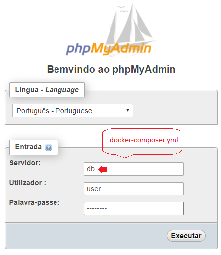

# eval-virtualbox-vm - Evaluation Virtual Box VM

---
## 1. Introduction

Evaluation Virtual Box VM is a guide project to install, configure and manage a lot of softwares into a Ubuntu 18.04 VM in Virtual Box.


### 1.1. Deploy Diagram


* Índice de **Componentes**:

 [NodeJS](#31-nodejs)
 [Java 8 - JDK](#32-java-8-jdk)
 [Python 2.7 - Pip3 - Jupyter Notebook](#33-python-27)
 [Jupyter Notebook](#314-jupyter-notebook)
 [UFW](#34-ufw)
 [PHP 7.3](#35-php-73)
 [MySQL](#36-mysql)
 [PostgreSQL](#37-postgresql)
 [MongoDB](#38-mongodb)
 [Casandra](#39-casandra)
 [Apache2](#310-apache2)
 [NGINX](#311-nginx)
 [Tomcat](#312-tomcat)
 [Jenkins](#313-jenkins)
 [Docker](#315-docker)
 [Docker Composer](#316-docker-composer---hello-world)
 [Docker Composer - MySQL e phpMyAdmin](#3161-docker-composer---mysql-57--php-myadmin)
 [Docker Composer - PostgreSQL e pgAdmin4](#3162-docker-composer---postgresql-96-pgadmin4)
 [Docker Composer - Wordpress](#37-docker-composer---wordpress-mysql-57)
 [Zabbix](#318-zabbix)
 [NMON](#319-nmon)
 [Kubernets](#320-kubernets)
 [Wordpress](#321-wordpress)
 [Pentaho Community](#322-pentaho-community)

---
## 2. Configuration Managment

### 2.1. Authentication Credentials
* ubuntu/ubuntu

### 2.2. Installing Virtual Box Guest Additions

* [https://www.virtualzero.net/blog/how-to-install-virtualbox-guest-additions-in-ubuntu-server-18.04-lts]


---
#### 2.2. Network Configurations
* Host -> Guest (127.0.0.1)
* Port(s): Apache2/NGINX(80,81,443), OpenSSH/SCP/FTP(22,21), Jenkins/Tomcat/(8080,8081), JupyterNotebook(8888), PostgreSQL(5432), MySQL(3306), Casandra(7000,7199,9042,9160), MongoDB(27017,27018,27019), pgAdmin4(16543), Rails/Redmine(3000)
* [Passo a passo da configuração da rede do Virtual Box](doc/README_NetworkConfiguration_StepByStep.md)


---
### 3. Installed Softwares and Packages

#### 3.1. NodeJs

#### a. Installation procedure

```sh
sudo apt install npm
npm -v # 3.5.2
```

---
#### 3.2. Java 8 JDK

#### a. Installation procedure

```sh
sudo apt install openjdk-8-jdk -y
```


---
#### 3.3. Python 2.7, Jupyter Notebook, Numpy

#### a. Installation procedure

* Step-by-Step installation **Python**

```sh
sudo apt upgrade
sudo apt update
sudo apt install python -y
sudo apt install python3-pip
pip3 --version
```

* Step-by-Step installation **Numpy**

```sh
sudo pip3 install numpy
```

* Step-by-Step installation **Jupyter Notebook** [Reading Pre-requisites before installation](https://www.digitalocean.com/community/tutorials/como-configurar-o-jupyter-notebook-com-python-3-no-ubuntu-18-04-pt)

```sh
# Install Python, Pip3 e VirtualEnv ...
sudo apt update
sudo apt install python3-pip python3-dev
sudo -H pip3 install --upgrade pip
sudo -H pip3 install virtualenv

# O flag -H garante politica de seguranca configure a variavel home para o diretório do usuário
cd ~/GitHome
mkdir ~/GitHome/py-jupyter-env
cd    ~/GitHome/py-jupyter-env
virtualenv py-jupyter-env # criando o ambiente virtual chamado 'py-jupyter-env'
source py-jupyter-env/bin/activate

# Install Jupyter no ambiente criado pelo virtualenv
pip install jupyter

# Generating Jupyter Notebook configuration file
jupyter notebook --generate-config

# Enabling 
vim /home/ubuntu/.jupyter/jupyter_notebook_config.py
  :
c.NotebookApp.allow_origin = '*' #allow all origins
c.NotebookApp.ip = '0.0.0.0' # listen on all IPs
  :


# Starting Jupyter Notebook
cd    ~/GitHome/py-jupyter-env
source py-jupyter-env/bin/activate
jupyter notebook
```


---
#### 3.4. UFW

#### a. Installation procedure

* [Reading Pre-requisites before installation](http://wiki.ubuntu-br.org/UFW)

```sh
sudo systemctl start  ufw
sudo systemctl status ufw
sudo systemctl enable ufw

sudo ufw status
sudo ufw status verbose
sudo ufw app list
sudo ufw allow 'OpenSSH' # port 22
sudo ufw allow 80/tcp    # Apache2, NGINX
sudo ufw allow 8080/tcp  # Jenkins/Tomcat/microk8s
sudo ufw allow 8081/tcp  # Jenkins/Tomcat/microk8s
sudo ufw allow 3306/tcp  # MySQL
sudo ufw allow 5432/tcp  # PostgreSQL
sudo ufw allow 8888/tcp  # JupyterNotebook
sudo ufw allow 27017/tcp # MongoDB mongod/mongos
sudo ufw allow 27018/tcp # MongoDB shardsrv
sudo ufw allow 27019/tcp # MongoDB configsrv
sudo ufw allow 18083/tcp # VBoxWebService
sudo ufw status verbose
```

---
#### 3.5. PHP 7.3

#### a. Installation procedure

* [Reading Pre-requisites before installation](https://www.rosehosting.com/blog/how-to-install-php-7-3-on-ubuntu-18-04/)

```sh
sudo apt upgrade
sudo apt update
sudo apt install software-properties-common
sudo apt install python-software-properties
sudo add-apt-repository ppa:ondrej/php
  :
  Press [ENTER] to continue or Ctrl-c to cancel adding it. [ENTER]
  :

sudo apt update
sudo apt-cache search php7.3
sudo apt install php7.3 php7.3-cli php7.3-common php7.3-opcache php7.3-curl php7.3-mbstring php7.3-mysql php7.3-zip php7.3-xml
php -v  # Verificar a versao 7.3
php --ini | grep "Loaded Configuration File"
sudo vim /etc/php/7.3/cli/php.ini
sudo vim /var/www/html/phpinfo.php
  :
<?php phpinfo(); ?>
  :

# Open url
http://IP-ADDRESS/phpinfo.php

# Stop and disable
sudo systemctl stop    apache2
sudo systemctl disable apache2
sudo systemctl status  apache2
```

---
#### 3.6. MySQL 

#### a. Installation procedure

```sh
sudo apt install mysql-server
sudo mysql_secure_installation # password: password
# setup VALIDATE PASSWORD plugin? N
# New password: password
# Re-enter new password: password
# Remove anonymous users? Y
# Disallow root login remotely? N
# Remove test database ? N
# Reload privilege tables now? Y
sudo vim /etc/mysql/mysql.conf.d/mysqld.cnf
  :
bind-address            = 0.0.0.0
  :

sudo systemctl start  mysql.service
sudo systemctl status mysql.service
sudo mysql
mysql> show databases;
+--------------------+
| Database           |
+--------------------+
| information_schema |
| mysql              |
| performance_schema |
| sys                |
+--------------------+
6 rows in set (0.27 sec)
mysql> CREATE USER 'user'@'%' IDENTIFIED BY 'password';
mysql> GRANT ALL PRIVILEGES ON *.* TO 'user'@'%' IDENTIFIED BY 'password' WITH GRANT OPTION;
mysql> ALTER USER user IDENTIFIED BY 'password';
mysql> FLUSH PRIVILEGES;
mysql> USE mysql
mysql> select Host, User from user;
+-----------+------------------+
| Host      | User             |
+-----------+------------------+
| %         | root             |
| %         | user             |
| localhost | debian-sys-maint |
| localhost | mysql.session    |
| localhost | mysql.sys        |
| localhost | root             |
+-----------+------------------+
mysql> EXIT
sudo systemctl stop    mysql.service
sudo systemctl disable mysql.service
```

#### b. Configuration management

* MySQL - port: 3306; User/Password: 'user'@'%' / 'password'


---
#### 3.7. PostgreSQL

#### a. Installation procedure

```sh
sudo apt install postgresql postgresql-contrib
sudo systemctl start  postgresql
sudo systemctl status postgresql
sudo -u postgres psql -c "SELECT version();"
sudo su - postgres
$ psql
postgres=# \l postgres
                               List of databases
   Name   |  Owner   | Encoding |   Collate   |    Ctype    | Access privileges
----------+----------+----------+-------------+-------------+------------------
 postgres | postgres | UTF8     | en_US.UTF-8 | en_US.UTF-8 |
(1 row)
sudo systemctl stop    postgresql
sudo systemctl disable postgresql
```


---
#### 3.8. MongoDB

#### a. Installation procedure

```sh
sudo apt install -y mongodb 
sudo systemctl start   mongodb
sudo systemctl status  mongodb
mongo --eval 'db.runCommand({ connectionStatus: 1 })'
sudo systemctl stop    mongodb
sudo systemctl disable mongodb
```

---
#### 3.9. Casandra

#### a. Installation procedure

* [Reading Pre-requisites before installation](http://cassandra.apache.org/download/) 

```sh
echo "deb http://www.apache.org/dist/cassandra/debian 311x main" | sudo tee -a /etc/apt/sources.list.d/cassandra.sources.list
curl https://www.apache.org/dist/cassandra/KEYS | sudo apt-key add -
sudo apt-get update
sudo apt-key adv --keyserver pool.sks-keyservers.net --recv-key A278B781FE4B2BDA
```

* Step-by-Step Casandra installation and post installation health check

```sh
sudo apt-get   install cassandra
sudo systemctl start   cassandra
sudo systemctl status  cassandra
nodetool status
cqlsh 
  cqsql> SELECT cluster_name, listen_address FROM system.local;
sudo systemctl stop    cassandra
sudo systemctl disable cassandra
```

---
#### 3.10. Apache2

#### a. Installation procedure

* [Reading Pre-requisites before installation](https://www.digitalocean.com/community/tutorials/how-to-install-the-apache-web-server-on-ubuntu-18-04-quickstart)

```sh
sudo apt-get   install apache2
sudo apt       install wget
sudo systemctl start   apache2
sudo systemctl status  apache2
cd /tmp ; wget "http://localhost" ; cd ~
sudo systemctl stop    apache2
sudo systemctl disable apache2
```

---
#### 3.11. NGINX

#### a. Installation procedure

* [Reading Pre-requisites before installation](https://www.digitalocean.com/community/tutorials/como-instalar-o-nginx-no-ubuntu-18-04-pt)

```sh
sudo apt install nginx
sudo ufw app list
sudo ufw allow 'Nginx HTTP'
sudo ufw status
sudo systemctl start  nginx
sudo systemctl status nginx
cd /tmp ; wget "http://localhost" ; cd ~
sudo systemctl stop    nginx
sudo systemctl disable nginx
```

---
#### 3.12. Tomcat

#### a. Installation procedure

* [Reading Pre-requisites before installation](https://linuxize.com/post/how-to-install-tomcat-9-on-ubuntu-18-04/)


```sh
$ sudo apt update
$ sudo apt install default-jdk
$ sudo useradd -r -m -U -d /opt/tomcat -s /bin/false tomcat
$ sudo apt install wget
$ echo Warning: version can change
$ wget http://www-eu.apache.org/dist/tomcat/tomcat-9/v9.0.17/bin/apache-tomcat-9.0.17.tar.gz -P /tmp
$ sudo tar xf /tmp/apache-tomcat-9*.tar.gz -C /opt/tomcat
$ sudo ln -s /opt/tomcat/apache-tomcat-9.0.17 /opt/tomcat/latest
$ sudo chown -RH tomcat: /opt/tomcat/latest
$ sudo sh -c 'chmod +x /opt/tomcat/latest/bin/*.sh'  # deu ruim aqui
$ sudo sh -c 'chmod +x /opt/tomcat/apache-tomcat-9.0.17/bin/*.sh'
$ sudo chmod +x /opt/tomcat/apache-tomcat-9.0.17/bin/*.sh
```

```sh
$ sudo vim /etc/systemd/system/tomcat.service
[Unit]
Description=Tomcat 9 servlet container
After=network.target

[Service]
Type=forking

User=tomcat
Group=tomcat

Environment="JAVA_HOME=/usr/lib/jvm/default-java"
Environment="JAVA_OPTS=-Djava.security.egd=file:///dev/urandom -Djava.awt.headless=true"

Environment="CATALINA_BASE=/opt/tomcat/latest"
Environment="CATALINA_HOME=/opt/tomcat/latest"
Environment="CATALINA_PID=/opt/tomcat/latest/temp/tomcat.pid"
Environment="CATALINA_OPTS=-Xms512M -Xmx1024M -server -XX:+UseParallelGC"

ExecStart=/opt/tomcat/latest/bin/startup.sh
ExecStop=/opt/tomcat/latest/bin/shutdown.sh

[Install]
WantedBy=multi-user.target
```

```sh
sudo systemctl daemon-reload
sudo systemctl start tomcat
sudo systemctl status tomcat
sudo systemctl stop tomcat
sudo systemctl disable tomcat
echo sudo ufw allow 8080/tcp
```


---
#### 3.13. Jenkins

#### a. Installation procedure

* [Reading Pre-requisites before installation](https://linuxize.com/post/how-to-install-jenkins-on-ubuntu-18-04/)

```sh
sudo apt install openjdk-8-jdk
sudo apt install wget
wget -q -O - https://pkg.jenkins.io/debian/jenkins.io.key | sudo apt-key add -
sudo sh -c 'echo deb http://pkg.jenkins.io/debian-stable binary/ > /etc/apt/sources.list.d/jenkins.list'
sudo apt update
sudo apt install jenkins
systemctl start  jenkins
systemctl status jenkins
systemctl stop jenkins
systemctl disable jenkins
```

* Configuration Management
    * Url: http://127.0.0.1:8080/
    * Authentication: admin/admin

---
---
#### 3.15. Docker

#### a. Installation procedure

* [Reading Pre-requisites before installation](https://phoenixnap.com/kb/how-to-install-docker-on-ubuntu-18-04/)

```sh
sudo apt-get remove docker docker-engine docker.io
sudo apt install docker.io
sudo systemctl start  docker
sudo systemctl status docker
sudo systemctl enable docker
```

---
#### 3.16. Docker Composer - hello-world

#### a. Installation procedure

* [Reading Pre-requisites before installation](https://www.digitalocean.com/community/tutorials/how-to-install-docker-compose-on-ubuntu-18-04)

```sh
$ cd ~
$ sudo curl -L https://github.com/docker/compose/releases/download/1.21.2/docker-compose-`uname -s`-`uname -m` -o /usr/local/bin/docker-compose
$ sudo chmod +x /usr/local/bin/docker-compose
$ docker-compose --version # docker-compose version 1.21.2, build a133471

# Edit 
$ vim docker-compose.yml
  :
my-test:
 image: hello-world
  :

# Start Docker
$ sudo systemctl start  docker.service # starting docker service ...
$ sudo docker-compose up # search for default file 'docker-compose.yml' and pull 'hello-world' image
Pulling my-test (hello-world:latest)...
latest: Pulling from library/hello-world
c04b14da8d14: Downloading [==================================================>] 
  :

$ sudo docker images # list all docker images pulled
REPOSITORY          TAG                 IMAGE ID            CREATED             SIZE
hello-world         latest              fce289e99eb9        2 months ago        1.84kB
  :

$ sudo docker ps # list images running ...
CONTAINER ID        IMAGE               COMMAND             CREATED             STATUS              PORTS               NAMES
  :

$ sudo docker ps -a # list all docker images independent if running or not ...
CONTAINER ID        IMAGE               COMMAND             CREATED             STATUS                          PORTS               NAMES
db160e0532ff        hello-world         "/hello"            5 minutes ago       Exited (0) About a minute ago                       hello-world_my-test_1
  :

```

#### b. Configuration management
  * n/a


---
#### 3.16.1. Docker Composer - MySQL 5.7 & Php MyAdmin

#### a. Installation procedure

* [Reading Pre-requisites before installation - MySQL](https://medium.com/@chrischuck35/how-to-create-a-mysql-instance-with-docker-compose-1598f3cc1bee)
* [Reading Pre-requisites before installation - MySQL e phpMyAdmin](https://share.atelie.software/subindo-um-banco-de-dados-mysql-e-phpmyadmin-com-docker-642be41f7638)

```sh
$ mkdir ~/docker-compose
$ mkdir ~/docker-compose/docker-mysql-phpmyadmin
$ cd ~/docker-compose/docker-mysql-phpmyadmin

$ vim docker-compose-mysql5.7.yml # ~/docker-mysql (only)
version: '3.3'
services:
  db:
    image: mysql:5.7
    restart: always
    environment:
      MYSQL_DATABASE: 'db'
      # So you don't have to use root, but you can if you like
      MYSQL_USER: 'user'
      # You can use whatever password you like
      MYSQL_PASSWORD: 'password'
      # Password for root access
      MYSQL_ROOT_PASSWORD: 'password'
    ports:
      # <Port exposed> : < MySQL Port running inside container>
      - '3306:3306'
    expose:
      # Opens port 3306 on the container
      - '3306'
      # Where our data will be persisted
    volumes:
      - my-db:/var/lib/mysql
# Names our volume
volumes:
  my-db:

$ vim docker-compose-mysql-phpmyadmin.yml # ~/docker-mysql, phpmyadmin
version: '3.3'
volumes:
  data:
services:
  db:
    image: mysql:5.7
    ports:
      - "3306:3306"
    volumes:
      - data:/var/lib/mysql
    environment:
      - MYSQL_ROOT_USER=user
      - MYSQL_ROOT_PASSWORD=password
      - MYSQL_DATABASE=app_development
  app:
    image: phpmyadmin/phpmyadmin:latest
    links:
      - db
    ports:
      - 80:80
    environment:
      - PMA_ARBITRARY=1

$ 

$ pwd # /home/ubuntu/docker-compose/docker-mysql-phpmyadmin
$ sudo docker-compose -f docker-compose-mysql5.7.yml up         # subindo imagem apenas com MySQL
$ sudo docker-compose -f docker-compose-mysql-phpmyadmin.yml up # subindo imagem apenas com MySQL

```

#### b. Configuration management

* docker-compose-mysql5.7.yml:
  * MySQL - port: 3306; user: user; password: password; volume: my-db
* docker-compose-mysql-phpmyadmin:
  * MySQL - port: 3306; user: user; password: password; volume: my-db
  * phpMyAdmin - port: 80/81; servidor db; user: user; password: password

#### c. Deploy Diagram


#### d. Demonstration

  * Subindo **docker-compose** com arquivo de configuração `docker-compose-mysql-phpmyadmin.yml`:

```sh
$ sudo docker-compose -f docker-compose-mysql-phpmyadmin.yml up         # subindo imagem apenas com MySQL
```


  * Conectando com MySQL através do client em linha de comando `mysql`:

```sh
$ mysql -h 127.0.0.1 -u user -ppassword
  :
mysql> show databases;
+--------------------+
| Database           |
+--------------------+
| information_schema |
| db                 |
+--------------------+
  :
```

  * Conectando com MySQL através da aplicação web **phpMyAdmin**:




---
#### 3.16.2. Docker Composer - PostgreSQL 9.6, pgAdmin4

#### a. Installation procedure

* [Reading Pre-requisites before installation - Official Documentation](https://linuxhint.com/run_postgresql_docker_compose/)
* [Reading Pre-requisites before installation - Blog using Docker Composer](https://medium.com/@renato.groffe/postgresql-pgadmin-4-docker-compose-montando-rapidamente-um-ambiente-para-uso-55a2ab230b89)
* [Reading Pre-requisites before installation - Stack Overflow about docker composer volume](https://stackoverflow.com/questions/41637505/how-to-persist-data-in-a-dockerized-postgres-database-using-volumes/41650891)
* [Reading Pre-requisites before installation - Stack Overflow about docker composer volume](https://stackoverflow.com/questions/42107364/how-to-use-volume-in-docker-compose-for-postgres)
* [Reading Pre-requisites before installation - pgAdmin4](https://hub.docker.com/r/dpage/pgadmin4/)

```sh
$ mkdir ~/docker-compose
$ mkdir ~/docker-compose/docker-postgresql-pgadmin4
$ cd    ~/docker-compose/docker-postgresql-pgadmin4

$ vim docker-compose.yml
version: '3'
volumes:
  pg-data:

services:
  db:
    image: postgres
    volumes:
      - pg-data:/var/lib/postgresql/data
    ports:
      - 5432:5432

  pgadmin:
    image: dpage/pgadmin4
    environment:
      PGADMIN_DEFAULT_EMAIL: "josemarsilva@yahoo.com.br"
      PGADMIN_DEFAULT_PASSWORD: "password"
    ports:
      - "16543:80"
    depends_on:
      - db

$ pwd # /home/ubuntu/docker-compose/docker-postgresql-pgadmin4
$ sudo docker-compose up

```

#### b. Configuration management

* docker-compose.yml:
  * PostgreSQL - port: 5432; user: postgres; password: ; volume: db
  * pgAdmin4 - port: 16543; email: josemarsilva@yahoo.com.br; password: password

#### c. Deploy Diagram


#### d. Demonstration

  * Subindo **docker-compose** com arquivo de configuração default `docker-compose.yml`:

```sh
$ sudo docker-compose up         # subindo imagem apenas com PostgreSQL
```


  * Conectando com PostgreSQL através do client em linha de comando `pgsql`:

```sh
$ sudo su - postgres
postgres@ubuntu-server:~$ psql -h 127.0.0.1 -U postgres
  :
postgres=# \l
                                 List of databases
   Name    |  Owner   | Encoding |  Collate   |   Ctype    |
-----------+----------+----------+------------+------------+
 postgres  | postgres | UTF8     | en_US.utf8 | en_US.utf8 |
 template0 | postgres | UTF8     | en_US.utf8 | en_US.utf8 |
 template1 | postgres | UTF8     | en_US.utf8 | en_US.utf8 |
           |          |          |            |            |
  :
postgres=# create database test_db;
postgres=# create user pguser with encrypted password 'password';
postgres=# grant all privileges on database test_db to pguser;
postgres=# \q
```

  * Conectando com PostgreSQL através da aplicação webapp **pgAdmin4**:


---
#### 3.16.3. Docker Composer - NPX HTTP Server (simple http server)

#### a. Installation procedure

* [Reading Pre-requisites before installation](https://share.atelie.software/subindo-um-servidor-web-em-1-minuto-31c0438ff6dd)

```sh
$ mkdir ~/docker-compose
$ mkdir ~/docker-compose/docker-npx-httpserver
$ cd    ~/docker-compose/docker-npx-httpserver

$ vim docker-compose.yml
version: '3'
services:
  web:
    image: node
    working_dir: /web
    command: npx http-server
    volumes:
      - .:/web
    ports:
      - 8080:8080

$ pwd # /home/ubuntu/docker-compose/docker-npx-httpserver
$ sudo docker-compose up
```

#### b. Configuration management

* docker-compose.yml:
  * NPX HTTP Server - port: 8080

#### c. Deploy Diagram

n/a

#### d. Demonstration

  * Suba **docker-compose** com arquivo de configuração default `docker-compose.yml`:
  * Faça wget http://localhost:8080


---
#### 3.16.4. Docker Composer - WordPress, MySQL 5.7

#### a. Installation procedure

* [Reading Pre-requisites before installation](https://docs.docker.com/compose/wordpress/)

```sh
$ mkdir ~/docker-compose/docker-wordpress-mysql
$ cd    ~/docker-compose/docker-wordpress-mysql
$ vim docker-compose.yml
version: '3.3'

services:
   db:
     image: mysql:5.7
     ports:
       - "3306:3306"
     volumes:
       - db_data:/var/lib/mysql
     restart: always
     environment:
       MYSQL_ROOT_PASSWORD: password
       MYSQL_DATABASE: wordpress
       MYSQL_USER: wordpress
       MYSQL_PASSWORD: wordpress

   wordpress:
     depends_on:
       - db
     image: wordpress:latest
     ports:
       - "80:80"
     restart: always
     environment:
       WORDPRESS_DB_HOST: db:3306
       WORDPRESS_DB_USER: wordpress
       WORDPRESS_DB_PASSWORD: wordpress
       WORDPRESS_DB_NAME: wordpress
volumes:
    db_data: {}

$ sudo docker-compose up
```

#### b. Configuration management

* docker-compose.yml:
  * WordPress - port: 80; Username: wordpress
  * MySQL - port: 3306; user: wordpress; password: wordpress; volume: db_data

#### c. Deploy Diagram

n/a

#### d. Demonstration

  * Suba **docker-compose** com arquivo de configuração default `docker-compose.yml`:
  * Faça wget http://localhost:80


---
#### 3.16.?. Docker Composer - Oracle Database

#### a. Installation procedure

* [Reading Pre-requisites before installation - OracleDatabase on Docker - Single Instance](https://github.com/oracle/docker-images/blob/master/OracleDatabase/SingleInstance/README.md)
* [Reading Pre-requisites before installation - OracleDatabase - Single Instance](https://www.oracle.com/technetwork/pt/articles/database-performance/oracle-db12-2-no-docker-4427706-ptb.html)

```sh
$ mkdir ~/GitHome
$ cd    ~/GitHome
$ git clone https://github.com/oracle/docker-images.git
$ git clone https://github.com/MaksymBilenko/docker-oracle-12c.git
$ cd docker-oracle-12c
$ cd ~/GitHome/docker-images/OracleDatabase/SingleInstance/dockerfiles
$ ./buildDockerImage.sh 12.2.0.1 -s
$ docker run --name oracle-12-2 \
-p 1521:1521 -p 5500:5500 \
-e ORACLE_SID=ORCL \
-e ORACLE_PDB=ORCLPDB \
-e ORACLE_PWD=password \
-e ORACLE_CHARACTERSET=AMERICAN_AMERICA.AL32UTF8 \
-v oradata:/opt/oracle/oradata \
oracle/database:12.2.0-se

$ vim docker-compose.yml


$ pwd # /home/ubuntu/docker-compose/docker-oracle
$ sudo docker-compose up
```

#### b. Configuration management

* docker-compose.yml:
  * Oracle Database - port: 1521; user: ???; password:??? ; volume: db

#### c. Deploy Diagram


#### d. Demonstration

  * Subindo **docker-compose** com arquivo de configuração default `docker-compose.yml`:


---
#### 3.16.?. Docker Composer - Oracle Database

#### a. Installation procedure
#### b. Configuration management
#### c. Deploy Diagram
#### d. Demonstration


---
#### 3.18. Zabbix

#### a. Installation procedure

* [Reading Pre-requisites before installation](https://websiteforstudents.com/how-to-install-zabbix-4-0-monitoring-system-with-apache2-mariadb-and-php-7-2-on-ubuntu-16-04-18-04-18-10/)


---
#### 3.19. NMON

#### a. Installation procedure
* [Reading Pre-requisites before installation](http://nmon.sourceforge.net/pmwiki.php?n=Site.ScreenShots)

* [Step-by-Step](http://josemarfuregattideabreusilva.blogspot.com/2012/05/)

```sh
which nmon
```

---
#### 3.20. Kubernets

#### a. Installation procedure

* Reading Pre-requisites before installation:
  * [About Kubernets](https://bit.ly/ubuntu-containerd)
  * [Step-by-Step](https://linuxconfig.org/how-to-install-kubernetes-on-ubuntu-18-04-bionic-beaver-linux)

```sh
sudo apt  install curl
sudo snap install microk8s --channel=1.14/beta --classic
sudo snap start   microk8s
sudo snap stop    microk8s
sudo snap disable microk8s
```

---
#### 3.21. WordPress

#### a. Installation procedure
* [Reading Pre-requisites before installation](https://www.rosehosting.com/blog/how-to-install-wordpress-with-lamp-stack-on-ubuntu-18-04/)

* Step-1: Install MySQL database

```sh
$ sudo mysql
  mysql> CREATE DATABASE wordpress;
  mysql> CREATE USER 'admin_user'@'localhost' IDENTIFIED BY 'admin_user';
  mysql> GRANT ALL PRIVILEGES ON wordpress.* TO 'admin_user'@'localhost' IDENTIFIED BY 'admin_user';
  mysql> FLUSH PRIVILEGES;
  mysql> exit
```

* Step-2: Install WordPress PHP source code

```sh
$ cd /var/www/html
$ sudo wget -c http://wordpress.org/latest.zip
$ sudo apt install unzip
$ sudo unzip latest.zip
$ sudo chown -R www-data:www-data wordpress
$ sudo rm latest.zip
$ cd /var/www/html/wordpress
$ sudo mv wp-config-sample.php wp-config.php
$ sudo vim wp-config.php
  :
define('DB_NAME', 'wordpress');
define('DB_USER', 'admin_user');
define('DB_PASSWORD', 'admin_user');
  :

$ sudo vim /etc/apache2/sites-available/wordpress.com.conf
<VirtualHost *:80>

ServerAdmin admin@wordpress.com
ServerName wordpress.com
ServerAlias www.wordpress.com
DocumentRoot /var/www/html/wordpress

<Directory /var/www/html/wordpress>
     Options Indexes FollowSymLinks
     AllowOverride All
     Require all granted
</Directory>

ErrorLog ${APACHE_LOG_DIR}/wordpress.com_error.log 
CustomLog ${APACHE_LOG_DIR}/wordpress.com_access.log combined 
</VirtualHost>

$ cd /etc/apache2/sites-enabled
$ sudo ln -s ../sites-available/wordpress.com.conf wordpress.com.conf
```

* Step-3: Configure WordPress Site
  * Site Title: `WordPress`
  * Username: `admin` - Password: `admin`
  * Click install button

 
#### 3.22. Pentaho Community

#### a. Installation procedure
* Reading Pre-requisites before installation
  * [Evaluation](https://help.pentaho.com/Documentation/8.2/Setup/Evaluation)

_Working in progress_
