# README eval-virtualbox-vm
README - Evaluation Virtual Box VM - Ubuntu 18.04

---
## 1. Introduction

Evaluation **Virtual Box VM** is a guide project to install, configure and manage a lot of softwares into a **Ubuntu 18.04** VM in Virtual Box.


### 1.1. Deploy Diagram


### 1.2. Deploy Installation Indexes

**High priority**:

* [NodeJs](#31-nodejs)
* [Python 3.6 - Pip3 - Jupyter Notebook](#33-python-36-jupyter-notebook-numpy)
* [Jupyter Notebook](#33-python-36-jupyter-notebook-numpy)
* [Java 8 - JDK](#32-java-8-jdk)
* [Docker Images, Dockerfile, Compose, Command Line](#4-docker)
* [Docker & Docker Composer - Installation](#41-docker---installation)

__Normal__:

* [Docker - Jenkins](#47-docker---jenkins)
* [Docker Composer - PostgreSQL e pgAdmin4](#44-docker-composer---postgresql-96-pgadmin4)
* [Docker Composer - MySQL e phpMyAdmin](#43-docker-composer---mysql-57--php-myadmin)
* [Docker Composer - Wordpress](#317-wordpress)
* [Docker Composer - MongoDB](#48-docker-composer---mongodb)
* [Docker Composer - R](#49-docker-composer---redmine)
* [Docker Composer - Kafka](#410-docker-composer---kafka)
* [Docker Composer - Cassandra](#411-docker-composer---cassandra)
* [Docker Composer - MQ-Series](#412-docker---mq-series)
* [Docker Composer - SugarCRM](#413-docker-composer---sugarcrm)
* [Docker - Bamboo Server](#414-docker---bamboo-server)
* [Docker - Jira Core](#421-docker---jira-core)
* [Docker - Confluence](#422-docker---confluence)
* [Docker - Ubuntu server](#415-docker---ubuntu-server)
* [Docker - Chef-server](#416-docker---chef-server)
* [Hercules](#319-hercules-mainframe-emulator)
* [Transmission-cli/Torrent Client](#320-transmission-cli)
* [Open Cobol](#321-compilador-cobol-free-linux)
* [Maven for Linux](#322-maven-for-linux)
* [Atlassian Bamboo for Linux Ubuntu](#323-atlassian-bamboo-for-linux-ubuntu)
* [Atlassian Jira Software Jira Core for Linux Ubuntu](#324-atlassian-jira-software-e-jira-core-for-linux-ubuntu)
* [Atlassian Bitbucket for Linux Ubuntu](#325-atlassian-bitbucket-for-linux-ubuntu)
* [Atlassian Bamboo agent for Windows](#326-atlassian-bamboo-agent-for-windows)

Low Priority:

* [UFW](#34-ufw)
* [PHP 7.3](#35-php-73)
* [MySQL](#36-mysql)
* [PostgreSQL](#37-postgresql)
* [MongoDB](#38-mongodb)
* [Casandra](#39-casandra)
* [Apache2](#310-apache2)
* [NGINX](#311-nginx)
* [Tomcat](#312-tomcat)
* [Jenkins](#313-jenkins)
* [Zabbix](#314-zabbix)
* [NMON](#315-nmon)
* [Kubernetes - miniKube](#316-kubernetes-minikube)
* [Wordpress](#317-wordpress)
* [Docker Composer - SugarCRM](#413-docker-composer---sugarcrm)
* [Docker - DB2](#424-docker---db2)
* [Dolibarr ERP / CRM](#328-dolibarr-erp--crm)

Very Priority:

* [Pentaho Community (Work in Progress)](#318-pentaho-community)
* [Docker Composer - Oracle (Work in Progress)](#46-docker-composer---oracle-database)


---
## 2. Configuration Managment

### 2.1. Authentication Credentials
* ubuntu/ubuntu

### 2.2. Installing Virtual Box Guest Additions

* https://www.virtualzero.net/blog/how-to-install-virtualbox-guest-additions-in-ubuntu-server-18.04-lts


---
#### 2.3. Network Configurations
* Host -> Guest (127.0.0.1)
* Port(s) redirected:

```cmd
Application         IP Hospedeiro PortaHospedeiro:PortaConvidado
--------------------------------- --------------------------------------------
HTTP/WebApp         127.0.0.1     80:80, 81:80, 8000, 8080, 8081, 8082, 8083
SSH                 127.0.0.1     22
SSL/HTTPS           127.0.0.1     443
FTP                 127.0.0.1     21
Bamboo              127.0.0.1     8085
Bitbucket           127.0.0.1     8089
Casandra            127.0.0.1     7000, 7199, 9042, 9160 
Hercules            127.0.0.1     3270, 8038, 992, 23, 3505 
Jupyter             127.0.0.1     8888
MongoDB             127.0.0.1     27017, 27018, 27019
MySQL               127.0.0.1     3306, 3307
PostgreSQL          127.0.0.1     5432
pgAdmin4            127.0.0.1     16543
NodeJs/Rails/Django 127.0.0.1     3000, 3001, 3002, 3003
SonarQube           127.0.0.1     9000
```

* [Passo a passo da configuração da rede do Virtual Box](doc/README_NetworkConfiguration_StepByStep.md)


---
#### 2.4. Configure default Time Zone

* Executar configuracao de Time Zone

```sh
$ sudo dpkg-reconfigure tzdata
```

* Select Geographic area: `America`
  * Select Time zone: `São Paulo`

```sh
Package configuration

  ┌─────────────────────────┤ Configuring tzdata ├──────────────────────────┐
  │ Please select the geographic area in which you live. Subsequent         │
  │ configuration questions will narrow this down by presenting a list of   │
  │ cities, representing the time zones in which they are located.          │
  │                                                                         │
  │ Geographic area:                                                        │
  │                                                                         │
  │                          Africa                 ↑                       │
  │                          America                ▮                       │
  │                          Antarctica             ▒                       │
  │                          Australia              ▒                       │
  │                          Arctic Ocean           ▒                       │
  │                          Asia                   ▒                       │
  │                          Atlantic Ocean         ▒                       │
  │                          Europe                 ↓                       │
  │                                                                         │
  │                                                                         │
  │                   <Ok>                       <Cancel>                   │
  │                                                                         │
  └─────────────────────────────────────────────────────────────────────────┘
```

```sh
Package configuration

     ┌───────────────────────┤ Configuring tzdata ├───────────────────────┐
     │ Please select the city or region corresponding to your time zone.  │
     │                                                                    │
     │ Time zone:                                                         │
     │                                                                    │
     │                    Recife                       ↑                  │
     │                    Regina                       ▒                  │
     │                    Resolute                     ▒                  │
     │                    Rio Branco                   ▒                  │
     │                    Santa Isabel                 ▒                  │
     │                    Santarém                     ▒                  │
     │                    Santiago                     ▒                  │
     │                    Santo Domingo                ▮                  │
     │                    São Paulo                    ▒                  │
     │                    Scoresbysund                 ↓                  │
     │                                                                    │
     │                                                                    │
     │                 <Ok>                     <Cancel>                  │
     │                                                                    │
     └────────────────────────────────────────────────────────────────────┘
```


---
### 3. Installed Softwares and Packages

#### 3.1. NodeJs

#### a. Installation procedure

```sh
sudo apt update -y
sudo apt install npm
npm -v # 3.5.2
```

---
#### 3.2. Java 8 JDK

#### a. Installation procedure

```sh
sudo apt install openjdk-8-jdk -y
```


---
#### 3.3. Python 3.6, Jupyter Notebook, Numpy

#### a. Installation procedure

* Step-by-Step installation **Python**

```sh
sudo add-apt-repository ppa:deadsnakes/ppa
sudo apt-get update
sudo apt-get install python3.6 -y
sudo apt install python-pip -y
python
>> import sys
>> print(sys.version)
>> quit()
pip list
```

* Step-by-Step installation **Numpy**

```sh
sudo pip install numpy
sudo pip install requests
```

* Step-by-Step installation **Jupyter Notebook** 

* [Reading Pre-requisites before installation](https://www.digitalocean.com/community/tutorials/como-configurar-o-jupyter-notebook-com-python-3-no-ubuntu-18-04-pt)

```sh
# Install Python, Pip3 e VirtualEnv ...
sudo apt update
sudo apt install python3-pip python3-dev -y
sudo -H pip3 install --upgrade pip
sudo -H pip3 install virtualenv

# O flag -H garante politica de seguranca configure a variavel home para o diretório do usuário
mkdir ~/GitHome ; cd ~/GitHome
mkdir ~/GitHome/py-jupyter-env
cd    ~/GitHome/py-jupyter-env
virtualenv venv # criando o ambiente virtual chamado 'py-jupyter-env'
source venv/bin/activate

# Install Jupyter no ambiente criado pelo virtualenv
pip install jupyter

# Generating Jupyter Notebook configuration file
jupyter notebook --generate-config

# Enabling 
vim /home/ubuntu/.jupyter/jupyter_notebook_config.py
  :
c.NotebookApp.allow_origin = '*' #allow all origins
c.NotebookApp.ip = '0.0.0.0' # listen on all IPs
  :

# Starting Jupyter Notebook
cd    ~/GitHome/py-jupyter-env
source venv/bin/activate
jupyter notebook
```


---
#### 3.4. UFW

#### a. Installation procedure

* [Reading Pre-requisites before installation](http://wiki.ubuntu-br.org/UFW)

```sh
sudo systemctl start  ufw
sudo systemctl status ufw
sudo systemctl enable ufw

sudo ufw status
sudo ufw status verbose
sudo ufw app list
sudo ufw allow 'OpenSSH' # port 22
sudo ufw allow 80/tcp    # Apache2, NGINX
sudo ufw allow 8080/tcp  # Jenkins/Tomcat/microk8s
sudo ufw allow 8081/tcp  # Jenkins/Tomcat/microk8s
sudo ufw allow 3306/tcp  # MySQL
sudo ufw allow 5432/tcp  # PostgreSQL
sudo ufw allow 8888/tcp  # JupyterNotebook
sudo ufw allow 27017/tcp # MongoDB mongod/mongos
sudo ufw allow 27018/tcp # MongoDB shardsrv
sudo ufw allow 27019/tcp # MongoDB configsrv
sudo ufw allow 18083/tcp # VBoxWebService
sudo ufw status verbose
```

---
#### 3.5. PHP 7.3

#### a. Installation procedure

* [Reading Pre-requisites before installation](https://www.rosehosting.com/blog/how-to-install-php-7-3-on-ubuntu-18-04/)

```sh
sudo apt upgrade -y
sudo apt update -y
sudo apt install software-properties-common
sudo apt install python-software-properties
sudo add-apt-repository ppa:ondrej/php
  :
  Press [ENTER] to continue or Ctrl-c to cancel adding it. [ENTER]
  :

sudo apt update -y
sudo apt-cache search php7.3
sudo apt install php7.3 php7.3-cli php7.3-common php7.3-opcache php7.3-curl php7.3-mbstring php7.3-mysql php7.3-zip php7.3-xml -y
php -v  # Verificar a versao 7.3
php --ini | grep "Loaded Configuration File"
sudo vim /etc/php/7.3/cli/php.ini
sudo vim /var/www/html/phpinfo.php
  :
<?php phpinfo(); ?>
  :

# Open url
http://IP-ADDRESS/phpinfo.php

# Stop and disable
sudo systemctl stop    apache2
sudo systemctl disable apache2
sudo systemctl status  apache2
```

---
#### 3.6. MySQL 

#### a. Installation procedure

```sh
sudo apt install mysql-server -y
sudo mysql_secure_installation # password: password
# setup VALIDATE PASSWORD plugin? N
# New password: password
# Re-enter new password: password
# Remove anonymous users? Y
# Disallow root login remotely? N
# Remove test database ? N
# Reload privilege tables now? Y
sudo vim /etc/mysql/mysql.conf.d/mysqld.cnf
  :
bind-address            = 0.0.0.0
  :

sudo systemctl start  mysql.service
sudo systemctl status mysql.service
sudo mysql
mysql> show databases;
+--------------------+
| Database           |
+--------------------+
| information_schema |
| mysql              |
| performance_schema |
| sys                |
+--------------------+
6 rows in set (0.27 sec)
mysql> CREATE USER 'user'@'%' IDENTIFIED BY 'password';
mysql> GRANT ALL PRIVILEGES ON *.* TO 'user'@'%' IDENTIFIED BY 'password' WITH GRANT OPTION;
mysql> ALTER USER user IDENTIFIED BY 'password';
mysql> FLUSH PRIVILEGES;
mysql> USE mysql
mysql> select Host, User from user;
+-----------+------------------+
| Host      | User             |
+-----------+------------------+
| %         | root             |
| %         | user             |
| localhost | debian-sys-maint |
| localhost | mysql.session    |
| localhost | mysql.sys        |
| localhost | root             |
+-----------+------------------+
mysql> EXIT
sudo systemctl stop    mysql.service
sudo systemctl disable mysql.service
```

#### b. Configuration management

* MySQL - port: 3306; User/Password: 'user'@'%' / 'password'


---
#### 3.7. PostgreSQL

#### a. Installation procedure

```sh
sudo apt install postgresql postgresql-contrib -y
sudo systemctl start  postgresql
sudo systemctl status postgresql
sudo -u postgres psql -c "SELECT version();"
sudo su - postgres
$ psql
postgres=# \l postgres
                               List of databases
   Name   |  Owner   | Encoding |   Collate   |    Ctype    | Access privileges
----------+----------+----------+-------------+-------------+------------------
 postgres | postgres | UTF8     | en_US.UTF-8 | en_US.UTF-8 |
(1 row)
postgres=# \q
postgres=# exit
sudo systemctl stop    postgresql
sudo systemctl disable postgresql
```

#### b. Configuration managment

* Step-01: Stop PostgreSQL Service

```sh
$ sudo systemctl stop postgresql
```

* Step-02: Configure `./postgresql.conf` to accept remote TCP/IP connections from all hosts

```sh
$ sudo find / -name "postgresql.conf"
/etc/postgresql/10/main/postgresql.conf
$ sudo cp /etc/postgresql/10/main/postgresql.conf /etc/postgresql/10/main/postgresql.conf.bkp-2020-06-10
$ sudo vim /etc/postgresql/10/main/postgresql.conf
  :
  listen_addresses = '*' # Listen connections from all hosts
  :
$ sudo su - postgres
```

* Step-03: Configure `./pg_hba.conf` to accept remote TCP/IP connections from all hosts with MD5 authentication

```sh
$ sudo find / -name "pg_hba.conf"
/etc/postgresql/10/main/pg_hba.conf
$ sudo cp /etc/postgresql/10/main/pg_hba.conf /etc/postgresql/10/main/pg_hba.conf.bkp.2020-06-11
$ sudo vim /etc/postgresql/10/main/pg_hba.conf
  :
  # IPv4 local connections:
  host    all             all             0.0.0.0/0            md5
  :
$ sudo su - postgres
```

* Step-04: Start PostgreSQL Service

```sh
$ sudo systemctl start postgresql
```

* Step-05: Create another administrative super user (don't use `postgres`)

```sh
$ sudo su - postgres
postgres@ubuntu:~$ psql
psql (10.12 (Ubuntu 10.12-0ubuntu0.18.04.1))
Type "help" for help.

postgres=# CREATE USER admin WITH PASSWORD 'admin' CREATEDB;
CREATE ROLE
postgres=# \q
postgres@ubuntu:~$ exit
logout
```

* Step-06: Teste remote connectionStatus

```sh
psql -h 127.0.0.1 -d postgres -U admin
Password for user admin:
psql (10.12 (Ubuntu 10.12-0ubuntu0.18.04.1))
SSL connection (protocol: TLSv1.2, cipher: ECDHE-RSA-AES256-GCM-SHA384, bits: 256, compression: off)
Type "help" for help.

postgres=> \q
$
```

---
#### 3.8. MongoDB

#### a. Installation procedure

```sh
sudo apt install -y mongodb 
sudo systemctl start   mongodb
sudo systemctl status  mongodb
mongo --eval 'db.runCommand({ connectionStatus: 1 })'
sudo systemctl stop    mongodb
sudo systemctl disable mongodb
```

---
#### 3.9. Casandra

#### a. Installation procedure

* [Reading Pre-requisites before installation](http://cassandra.apache.org/download/) 

```sh
echo "deb http://www.apache.org/dist/cassandra/debian 311x main" | sudo tee -a /etc/apt/sources.list.d/cassandra.sources.list
curl https://www.apache.org/dist/cassandra/KEYS | sudo apt-key add -
sudo apt-get update
sudo apt-key adv --keyserver pool.sks-keyservers.net --recv-key A278B781FE4B2BDA
```

* Step-by-Step Casandra installation and post installation health check

```sh
sudo apt-get   install cassandra -y
sudo systemctl start   cassandra
sudo systemctl status  cassandra
nodetool status
cqlsh 
  cqsql> SELECT cluster_name, listen_address FROM system.local;
  cqsql> exit
sudo systemctl stop    cassandra
sudo systemctl disable cassandra
```

---
#### 3.10. Apache2

#### a. Installation procedure

* [Reading Pre-requisites before installation](https://www.digitalocean.com/community/tutorials/how-to-install-the-apache-web-server-on-ubuntu-18-04-quickstart)

```sh
sudo apt-get   install apache2 -y
sudo apt       install wget
sudo systemctl start   apache2
sudo systemctl status  apache2
cd /tmp ; wget "http://localhost" ; cd ~ ; cat /tmp/index.html ; rm -f /tmp/index.html
sudo systemctl stop    apache2
sudo systemctl disable apache2
```

---
#### 3.11. NGINX

#### a. Installation procedure

* [Reading Pre-requisites before installation](https://www.digitalocean.com/community/tutorials/como-instalar-o-nginx-no-ubuntu-18-04-pt)

```sh
sudo apt install nginx -y
sudo ufw app list
sudo ufw allow 'Nginx HTTP'
sudo ufw status
sudo systemctl start  nginx
sudo systemctl status nginx
cd /tmp ; wget "http://localhost" ; cd ~ ; cat /tmp/index.html
sudo systemctl stop    nginx
sudo systemctl disable nginx
```

#### b. Configuring

```sh
$ sudo mkdir -p /var/www/virtualbox/html
$ sudo chown -R $USER:$USER /var/www/virtualbox/html
$ sudo chmod -R 755 /var/www/virtualbox
$ mkdir -p /opt/devops-labs-share/environment
$ mkdir -p /opt/devops-labs-share/package-release
$ ln -s /opt/devops-labs-share /var/www/virtualbox/html/devops-labs-share
$ sudo vim /etc/nginx/sites-available/virtualbox
$ sudo ln -s /etc/nginx/sites-available/virtualbox /etc/nginx/sites-enabled/
$ sudo nginx -t
```

---
#### 3.12. Tomcat

#### a. Installation procedure

* [Reading Pre-requisites before installation](https://linuxize.com/post/how-to-install-tomcat-9-on-ubuntu-18-04/)


```sh
$ sudo apt update -y
$ sudo useradd -r -m -U -d /opt/tomcat -s /bin/false tomcat
$ sudo apt install wget
$ echo Warning: version can change
$ wget http://www-eu.apache.org/dist/tomcat/tomcat-9/v9.0.17/bin/apache-tomcat-9.0.17.tar.gz -P /tmp
$ sudo tar xf /tmp/apache-tomcat-9*.tar.gz -C /opt/tomcat
$ sudo chmod a+x,a+r,a+w /opt
$ sudo chmod -R u+r,g+r,o+r /opt/tomcat
$ sudo chmod -R u+w,g+w,o+w /opt/tomcat
$ sudo chmod -R u+x,g+x,o+x /opt/tomcat/apache-tomcat-9.0.17/bin
$ sudo chmod -R g+x,o+x /opt/tomcat/apache-tomcat-9.0.17/conf
$ sudo chmod -R g+x,o+x /opt/tomcat/apache-tomcat-9.0.17/lib
$ sudo chmod -R g+x,o+x /opt/tomcat/apache-tomcat-9.0.17/logs
$ sudo chmod -R g+x,o+x /opt/tomcat/apache-tomcat-9.0.17/temp
$ sudo chmod -R g+x,o+x /opt/tomcat/apache-tomcat-9.0.17/webapps
$ sudo chmod -R g+x,o+x /opt/tomcat/apache-tomcat-9.0.17/work
$ sudo ln -s /opt/tomcat/apache-tomcat-9.0.17 /opt/tomcat/latest
$ sudo chown -RH tomcat:tomcat /opt/tomcat/latest
$ sudo sh -c 'chmod +x+r+w /opt/tomcat/latest/bin/*.sh'
$ sudo sh -c 'chmod +x /opt/tomcat/apache-tomcat-9.0.17/bin/*.sh'
$ sudo chmod +x /opt/tomcat/apache-tomcat-9.0.17/bin/*.sh
```

```sh
$ sudo ln -s /usr/lib/jvm/java-8-openjdk-amd64/jre /usr/lib/jvm/default-java
$ sudo vim /etc/systemd/system/tomcat.service
[Unit]
Description=Tomcat 9 servlet container
After=network.target

[Service]
Type=forking

User=tomcat
Group=tomcat

Environment="JAVA_HOME=/usr/lib/jvm/default-java"
Environment="JAVA_OPTS=-Djava.security.egd=file:///dev/urandom -Djava.awt.headless=true"

Environment="CATALINA_BASE=/opt/tomcat/latest"
Environment="CATALINA_HOME=/opt/tomcat/latest"
Environment="CATALINA_PID=/opt/tomcat/latest/temp/tomcat.pid"
Environment="CATALINA_OPTS=-Xms512M -Xmx1024M -server -XX:+UseParallelGC"

ExecStart=/opt/tomcat/latest/bin/startup.sh
ExecStop=/opt/tomcat/latest/bin/shutdown.sh

[Install]
WantedBy=multi-user.target
```

```sh
sudo systemctl daemon-reload
sudo systemctl start tomcat
sudo systemctl status tomcat
sudo systemctl stop tomcat
sudo systemctl disable tomcat
sudo ufw allow 8080/tcp
```


---
#### 3.13. Jenkins

#### a. Installation procedure

* [Reading Pre-requisites before installation](https://linuxize.com/post/how-to-install-jenkins-on-ubuntu-18-04/)

```sh
sudo apt install openjdk-8-jdk
sudo apt install wget
wget -q -O - https://pkg.jenkins.io/debian/jenkins.io.key | sudo apt-key add -
sudo sh -c 'echo deb http://pkg.jenkins.io/debian-stable binary/ > /etc/apt/sources.list.d/jenkins.list'
sudo apt update
sudo apt install jenkins -y
sudo systemctl start  jenkins
sudo systemctl status jenkins
sudo systemctl disable jenkins
```


* Configuration Management

  * Open Jenkins url in your browser: [http://localhost:8080/] ànd copy initial administration password configuration

```sh
sudo cat /var/lib/jenkins/secrets/initialAdminPassword
```

  * Paste initial administration password configuration into browser


  * Install suggestted plugins

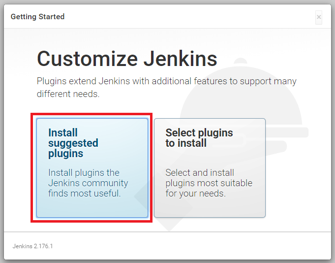

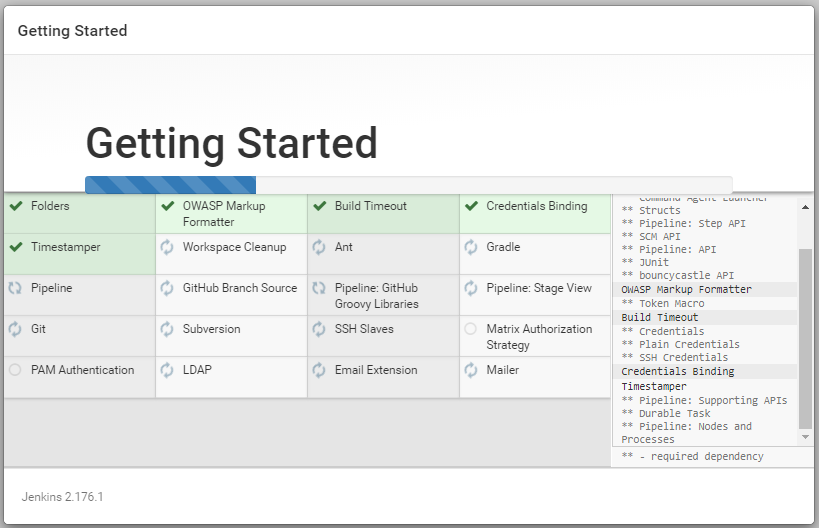

  * Configure admin user
 
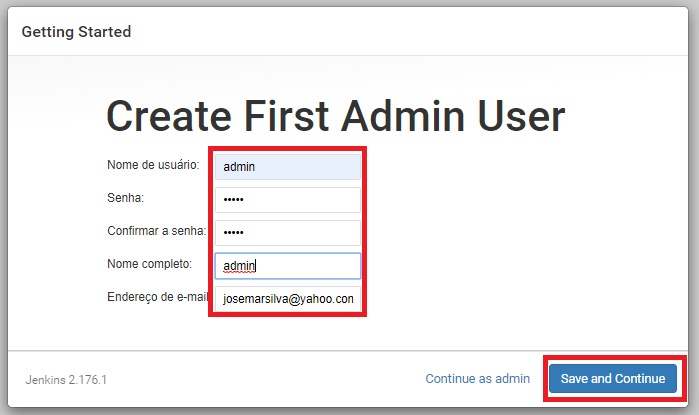

  * Configure Jenkins URL

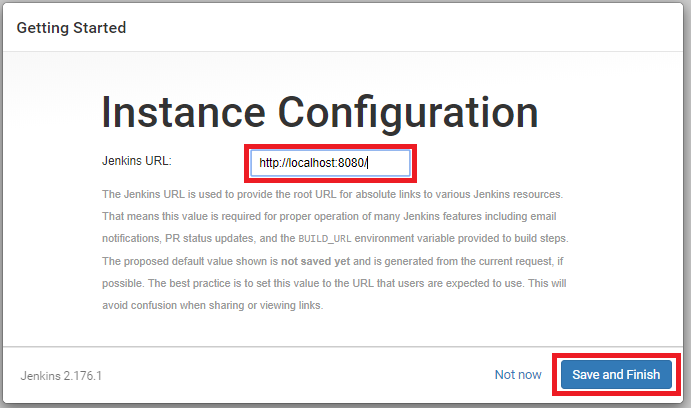

  * Benvindo ao Jenkins

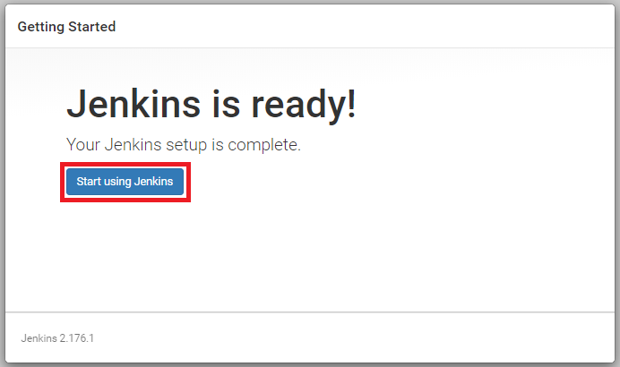


---
#### 3.14. Zabbix

#### a. Installation procedure

* [Reading Pre-requisites before installation](https://websiteforstudents.com/how-to-install-zabbix-4-0-monitoring-system-with-apache2-mariadb-and-php-7-2-on-ubuntu-16-04-18-04-18-10/)
* [Reading](https://hub.docker.com/r/zabbix/zabbix-server-pgsql)


---
#### 3.15. NMON

#### a. Installation procedure
* [Reading Pre-requisites before installation](http://nmon.sourceforge.net/pmwiki.php?n=Site.ScreenShots)

* [Step-by-Step](http://josemarfuregattideabreusilva.blogspot.com/2012/05/)

```sh
which nmon
```

---
#### 3.16. Kubernetes minikube

#### a. Installation procedure

#### a.1. Linux Ubuntu 20.04

* Reading Pre-requisites before installation:
  * https://phoenixnap.com/kb/install-minikube-on-ubuntu
  * https://kubernetes.io/docs/setup/
  * https://www.youtube.com/watch?v=Cn3G9Bg0F4c
  

* Step-00: Check pre-requisites before start

```sh
df -h /  # you must have about 20 MB free disk space
nproc    # you must have at least 2 CPU's 
```

* Step-01: Install minikube dependencies

```sh
sudo apt-get update -y
sudo apt-get install curl apt-transport-https -y
sudo apt install virtualbox virtualbox-ext-pack -y
   +--------------------| Configuring virtualbox-ext-pack |--------------------+
   |                                                                           |
   | Oracle Corporation requests VirtualBox users to acknowledge and accept    |
   | the "VirtualBox Personal Use and Evaluation License" (PUEL). Please ...   |
   |                                                                           |
   |                                <Ok>                                       |
   +---------------------------------------------------------------------------+
# accept "OK"
   +--------------------| Configuring virtualbox-ext-pack |--------------------+
   | Do you accept the terms of the VirtualBox PUEL license?                   |
   |         [ Yes ] [ No ]                                                    |
   +---------------------------------------------------------------------------+
# accept "Yes"
```

* Step-02: Install minikube

```sh
wget https://storage.googleapis.com/minikube/releases/latest/minikube-linux-amd64
sudo mv minikube-linux-amd64 /usr/local/bin/minikube
sudo chmod 755 /usr/local/bin/minikube
minikube version
    minikube version: v1.20.0
    commit: c61663e942ec43b20e8e70839dcca52e44cd85ae
```

* Step-03: Install kubectl

```sh
curl -LO https://storage.googleapis.com/kubernetes-release/release/`curl -s https://storage.googleapis.com/kubernetes-release/release/stable.txt`/bin/linux/amd64/kubectl
chmod +x ./kubectl
sudo mv ./kubectl /usr/local/bin/kubectl
kubectl version -o json
    {
      "clientVersion": {
        "major": "1",
        "minor": "21",
        "gitVersion": "v1.21.1",
        "gitCommit": "5e58841cce77d4bc13713ad2b91fa0d961e69192",
        "gitTreeState": "clean",
        "buildDate": "2021-05-12T14:18:45Z",
        "goVersion": "go1.16.4",
        "compiler": "gc",
        "platform": "linux/amd64"
      },
      "serverVersion": {
        "major": "1",
        "minor": "20",
        "gitVersion": "v1.20.2",
        "gitCommit": "faecb196815e248d3ecfb03c680a4507229c2a56",
        "gitTreeState": "clean",
        "buildDate": "2021-01-13T13:20:00Z",
        "goVersion": "go1.15.5",
        "compiler": "gc",
        "platform": "linux/amd64"
      }
    }
# ignore message because service was not started "The connection to the server localhost:8080 was refused - did you specify the right host or port?"
```

* Step-04: Start minikube 

```sh
minikube start
    ubuntu@ubuntu:~$ minikube start
    * minikube v1.20.0 on Ubuntu 20.04
    * Automatically selected the virtualbox driver. Other choices: none, ssh
    * Downloading VM boot image ...
    * Starting control plane node minikube in cluster minikube
    * Downloading Kubernetes v1.20.2 preload ...
    * Starting control plane node minikube in cluster minikube
    * Pulling base image ...
    * Creating docker container (CPUs=2, Memory=2200MB) ...
    * Preparing Kubernetes v1.20.2 on Docker 20.10.6 ...
    * Verifying Kubernetes components...
    * Enabled addons: storage-provisioner, default-storageclass
    * Done! kubectl is now configured to use "minikube" cluster and "default" namespace by default
```

#### a.2. Windows 10

* Reading Pre-requisites before installation:
  * https://github.com/badtuxx/DescomplicandoKubernetes/blob/main/day-1/DescomplicandoKubernetes-Day1.md#instala%C3%A7%C3%A3o-no-windows-1
  * https://technology.amis.nl/platform/installing-minikube-and-kubernetes-on-windows-10/
  * https://docs.docker.com/toolbox/toolbox_install_windows/

* Step-00: Check pre-requisites before start
  * Virtualização da BIOS do hardware habilitada (VT-X ou AMD-v)
  * Virtualização do Windows habilitada e Virtualizador instalado: Opção escolhida **Oracle Virtual Box**

```cmd
C:\> systeminfo
        :
      Requisitos do Hyper-V:                     Extensão de Modo de Monitor VM: Sim
                                                 Virtualização Habilitada no Firmware: Sim
                                                 Conversão de Endereços de Segundo Nível: Sim
                                                 Prevenção de Execução de Dados Disponível: Sim
C:\>       
```

* Step-01: Download and install `minikube` for Windows

```cmd
C:\Users\josemarsilva> CD %USERPROFILE%\Downloads
C:\Users\josemarsilva\downloads> start https://github.com/kubernetes/minikube/releases/download/v1.20.0/minikube-installer.exe
C:\Users\josemarsilva\downloads> dir /b minikube-installer.exe
C:\Users\josemarsilva\downloads> minikube-installer.exe
    +---------------------------------------+
    | Please select a language: [ English ] |
    +---------------------------------------+
```

* Step-02: Start, Stop, Configure Driver for Oracle Virtual Box

```cmd
C:\Users\josemarsilva> minikube config set driver virtualbox
! These changes will take effect upon a minikube delete and then a minikube start

C:\Users\josemarsilva> minikube start
* minikube v1.20.0 on Microsoft Windows 10 Pro 10.0.19042 Build 19042
* Using the virtualbox driver based on user configuration
* Downloading VM boot image ...
    > minikube-v1.20.0.iso.sha256: 65 B / 65 B [-------------] 100.00% ? p/s 0s
    > minikube-v1.20.0.iso: 245.40 MiB / 245.40 MiB [ 100.00% 3.60 MiB p/s 1m8s
* Starting control plane node minikube in cluster minikube
* Downloading Kubernetes v1.20.2 preload ...
    > preloaded-images-k8s-v10-v1...: 3.98 MiB / 491.71 MiB  0.81% 736.40 KiB p

C:\Users\josemarsilva\downloads> minikube delete

```

* Step-03: Download and install `kubectl` for Windows

```cmd
C:\Users\josemarsilva> CD %USERPROFILE%\Downloads
C:\Users\josemarsilva\Downloads> curl -o kubectl.exe https://storage.googleapis.com/kubernetes-release/release/v1.19.1/bin/windows/amd64/kubectl.exe
C:\Users\josemarsilva\Downloads> MD C:\Apps
C:\Users\josemarsilva\Downloads> MD C:\Apps\kubectl
C:\Users\josemarsilva\Downloads> COPY /Y kubectl.exe C:\Apps\kubectl\kubectl.exe
C:\Users\josemarsilva\Downloads> DEL /Q kubectl.exe
C:\Users\josemarsilva\Downloads> SET PATH=%PATH%;C:\Apps\kubectl
C:\Users\josemarsilva\Downloads> kubectl --help
kubectl controls the Kubernetes cluster manager.

 Find more information at: https://kubernetes.io/docs/reference/kubectl/overview/

Basic Commands (Beginner):
  :
Basic Commands (Intermediate):
  :
Deploy Commands:
  :
Cluster Management Commands:
  :
Troubleshooting and Debugging Commands:
  :
Advanced Commands:
  :
Settings Commands:
  :
Other Commands:
  :

Usage:
  kubectl [flags] [options]
```

* Step-04: Adicione o sub-diretório de instalação do `kubectl` ao PATH do Windows de forma definitiva
  * Inicie o painel de controle `C:\user\josemarsilva> start control`
  * Em `Windows::Painel de Controle` clique no botão do ícone `Sistema`
  * Em `Windows::Painel de Controle >> Sistema` clique no link lateral direito `Configurações avançadas do sistema`
  * Em `Windows::Painel de Controle >> Sistema >> Configurações avançadas do sistema` clique no botão `Variáveis de Ambiente`
  * Em `Windows::Painel de Controle >> Sistema >> Configurações avançadas do sistema >> Variáveis de ambiente` localize na lista `Variávies de sistema` a variável `Path`. Com um clique duplo edite a variável e acrescente o caminho onde foi instalado o Kubectl `C:\Apps\kubectl`
  * Verifique se o `kubectl` está funcionando corretamente. Abra o `Prompt de Commando do Windows`:

```cmd
C:\Users\josemarsilva\Downloads> kubectl --help
kubectl controls the Kubernetes cluster manager.
   :
```


#### b. Configuration management

*  Step-01: View Configuration, cluster-info, nodes, pods, ssh 


```sh
kubectl config view
  :
apiVersion: v1
clusters:
contexts:
current-context: minikube
kind: Config
preferences: {}
users:
  :

kubectl cluster-info
    Kubernetes control plane is running at https://192.168.49.2:8443
    KubeDNS is running at https://192.168.49.2:8443/api/v1/namespaces/kube-system/services/kube-dns:dns/proxy
    To further debug and diagnose cluster problems, use 'kubectl cluster-info dump'.

kubectl get nodes
    NAME       STATUS   ROLES                  AGE   VERSION
    minikube   Ready    control-plane,master   22m   v1.20.2

kubectl get pod
    No resources found in default namespace.

minikube ssh
    Last login: Wed Jun  9 23:08:01 2021 from 192.168.49.1
    docker@minikube:~$ id
    uid=1000(docker) gid=999(docker) groups=999(docker),27(sudo),110(podman)
    docker@minikube:~$ exit
    logout
```


#### c. Deploy

* Stop, status, start, delete node cluster, list addons, dashboard

```sh
minikube stop
    * Stopping node "minikube"  ...
    * Powering off "minikube" via SSH ...
    * 1 nodes stopped.

minikube status
    minikube
    type: Control Plane
    host: Stopped
    kubelet: Stopped
    apiserver: Stopped
    kubeconfig: Stopped

minikube delete
    * Deleting "minikube" in docker ...
    * Deleting container "minikube" ...
    * Removing /home/ubuntu/.minikube/machines/minikube ...
    * Removed all traces of the "minikube" cluster.

minikube addons list
|-----------------------------|----------|--------------|
|         ADDON NAME          | PROFILE  |    STATUS    |
|-----------------------------|----------|--------------|
| ambassador                  | minikube | disabled     |
| auto-pause                  | minikube | disabled     |
| csi-hostpath-driver         | minikube | disabled     |
| dashboard                   | minikube | disabled     |
| default-storageclass        | minikube | enabled ✅   |
| efk                         | minikube | disabled     |
| freshpod                    | minikube | disabled     |
| gcp-auth                    | minikube | disabled     |
| gvisor                      | minikube | disabled     |
| helm-tiller                 | minikube | disabled     |
| ingress                     | minikube | disabled     |
| ingress-dns                 | minikube | disabled     |
| istio                       | minikube | disabled     |
| istio-provisioner           | minikube | disabled     |
| kubevirt                    | minikube | disabled     |
| logviewer                   | minikube | disabled     |
| metallb                     | minikube | disabled     |
| metrics-server              | minikube | disabled     |
| nvidia-driver-installer     | minikube | disabled     |
| nvidia-gpu-device-plugin    | minikube | disabled     |
| olm                         | minikube | disabled     |
| pod-security-policy         | minikube | disabled     |
| registry                    | minikube | disabled     |
| registry-aliases            | minikube | disabled     |
| registry-creds              | minikube | disabled     |
| storage-provisioner         | minikube | enabled ✅   |
| storage-provisioner-gluster | minikube | disabled     |
| volumesnapshots             | minikube | disabled     |
|-----------------------------|----------|--------------|

minikube dashboard
* Enabling dashboard ...
  - Using image kubernetesui/dashboard:v2.1.0
  - Using image kubernetesui/metrics-scraper:v1.0.4
* Verifying dashboard health ...
* Launching proxy ...
* Verifying proxy health ...
* Opening http://127.0.0.1:42767/api/v1/namespaces/kubernetes-dashboard/services/http:kubernetes-dashboard:/proxy/ in your default browser...
  http://127.0.0.1:42767/api/v1/namespaces/kubernetes-dashboard/services/http:kubernetes-dashboard:/proxy/
```

#### d. Demonstration

* https://kubernetes.io/docs/tutorials/hello-minikube/

* Create deployment, deployments, events, create service, 

```sh
kubectl create deployment hello-minikube --image=k8s.gcr.io/echoserver:1.10
deployment.apps/hello-minikube created

kubectl get deployments
    NAME             READY   UP-TO-DATE   AVAILABLE   AGE
    hello-minikube   1/1     1            1           3m23s

kubectl get pods
    NAME                              READY   STATUS    RESTARTS   AGE
    hello-minikube-5d9b964bfb-ssgjj   1/1     Running   0          4m34s

kubectl get events
    LAST SEEN   TYPE     REASON                    OBJECT                                 MESSAGE
    5m1s        Normal   Scheduled                 pod/hello-minikube-5d9b964bfb-ssgjj    Successfully assigned default/hello-minikube-5d9b964bfb-ssgjj to minikube
    5m          Normal   Pulling                   pod/hello-minikube-5d9b964bfb-ssgjj    Pulling image "k8s.gcr.io/echoserver:1.10"
    4m2s        Normal   Pulled                    pod/hello-minikube-5d9b964bfb-ssgjj    Successfully pulled image "k8s.gcr.io/echoserver:1.10" in 57.379134224s
    4m2s        Normal   Created                   pod/hello-minikube-5d9b964bfb-ssgjj    Created container echoserver
    4m2s        Normal   Started                   pod/hello-minikube-5d9b964bfb-ssgjj    Started container echoserver
    5m1s        Normal   SuccessfulCreate          replicaset/hello-minikube-5d9b964bfb   Created pod: hello-minikube-5d9b964bfb-ssgjj
    5m1s        Normal   ScalingReplicaSet         deployment/hello-minikube              Scaled up replica set hello-minikube-5d9b964bfb to 1
    30m         Normal   NodeHasSufficientMemory   node/minikube                          Node minikube status is now: NodeHasSufficientMemory
    30m         Normal   NodeHasNoDiskPressure     node/minikube                          Node minikube status is now: NodeHasNoDiskPressure
    30m         Normal   NodeHasSufficientPID      node/minikube                          Node minikube status is now: NodeHasSufficientPID
    30m         Normal   Starting                  node/minikube                          Starting kubelet.
    30m         Normal   NodeHasSufficientMemory   node/minikube                          Node minikube status is now: NodeHasSufficientMemory
    30m         Normal   NodeHasNoDiskPressure     node/minikube                          Node minikube status is now: NodeHasNoDiskPressure
    30m         Normal   NodeHasSufficientPID      node/minikube                          Node minikube status is now: NodeHasSufficientPID
    30m         Normal   NodeNotReady              node/minikube                          Node minikube status is now: NodeNotReady
    30m         Normal   NodeAllocatableEnforced   node/minikube                          Updated Node Allocatable limit across pods
    29m         Normal   NodeReady                 node/minikube                          Node minikube status is now: NodeReady
    29m         Normal   RegisteredNode            node/minikube                          Node minikube event: Registered Node minikube in Controller
    29m         Normal   Starting                  node/minikube                          Starting kube-proxy.


kubectl expose deployment hello-minikube --type=LoadBalancer --port=8080
    service/hello-minikube exposed

kubectl get services
    NAME             TYPE           CLUSTER-IP      EXTERNAL-IP   PORT(S)          AGE
    hello-minikube   LoadBalancer   10.106.12.231   <pending>     8080:30258/TCP   59s
    kubernetes       ClusterIP      10.96.0.1       <none>        443/TCP          35m

minikube service hello-minikube
    |-----------|----------------|-------------|---------------------------|
    | NAMESPACE |      NAME      | TARGET PORT |            URL            |
    |-----------|----------------|-------------|---------------------------|
    | default   | hello-minikube |        8080 | http://192.168.49.2:30258 |
    |-----------|----------------|-------------|---------------------------|
    * Opening service default/hello-minikube in default browser...
      http://192.168.49.2:30258


```

* Delete service, delete deployment, stop minikube

```sh
kubectl delete service hello-node
kubectl delete deployment hello-node
minikube stop
```


---
#### 3.17. WordPress

#### a. Installation procedure
* [Reading Pre-requisites before installation](https://www.rosehosting.com/blog/how-to-install-wordpress-with-lamp-stack-on-ubuntu-18-04/)

* Step-1: Install MySQL database

```sh
$ sudo mysql
  mysql> CREATE DATABASE wordpress;
  mysql> CREATE USER 'admin_user'@'localhost' IDENTIFIED BY 'admin_user';
  mysql> GRANT ALL PRIVILEGES ON wordpress.* TO 'admin_user'@'localhost' IDENTIFIED BY 'admin_user';
  mysql> FLUSH PRIVILEGES;
  mysql> exit
```

* Step-2: Install WordPress PHP source code

```sh
$ cd /var/www/html
$ sudo wget -c http://wordpress.org/latest.zip
$ sudo apt install unzip
$ sudo unzip latest.zip
$ sudo chown -R www-data:www-data wordpress
$ sudo rm latest.zip
$ cd /var/www/html/wordpress
$ sudo mv wp-config-sample.php wp-config.php
$ sudo vim wp-config.php
  :
define('DB_NAME', 'wordpress');
define('DB_USER', 'admin_user');
define('DB_PASSWORD', 'admin_user');
  :

$ sudo vim /etc/apache2/sites-available/wordpress.com.conf
<VirtualHost *:80>

ServerAdmin admin@wordpress.com
ServerName wordpress.com
ServerAlias www.wordpress.com
DocumentRoot /var/www/html/wordpress

<Directory /var/www/html/wordpress>
     Options Indexes FollowSymLinks
     AllowOverride All
     Require all granted
</Directory>

ErrorLog ${APACHE_LOG_DIR}/wordpress.com_error.log 
CustomLog ${APACHE_LOG_DIR}/wordpress.com_access.log combined 
</VirtualHost>

$ cd /etc/apache2/sites-enabled
$ sudo ln -s ../sites-available/wordpress.com.conf wordpress.com.conf
```

* Step-3: Configure WordPress Site
  * Site Title: `WordPress`
  * Username: `admin` - Password: `admin`
  * Click install button

 
#### 3.18. Pentaho Community

#### a. Installation procedure
* Reading Pre-requisites before installation
  * [Evaluation](https://help.pentaho.com/Documentation/8.2/Setup/Evaluation)

_Working in progress_


---
#### 3.19. Hercules Mainframe Emulator

#### a. Installation procedure

* [Reading Pre-requisites - Hercules](http://www.hercules-390.eu/)


* Installing

```sh
sudo mkdir cd /opt
sudo chmod 777 /opt
cd /opt
wget http://www.hercules-390.org/hercules-3.07.tar.gz
tar -xvf hercules-3.07.tar.gz
cd hercules-3.07/
sudo ./configure
sudo make install
sudo chown ubuntu:ubuntu ./hercules-3.07 -R
which hercules
ls -la /usr/local/bin/hercules
```


#### b. Configuration management

* n/a


#### c. Deploy Diagram

* n/a

#### d. Demonstration

* n/a


---
#### 3.20. Transmission cli

#### a. Installation procedure

* [Reading Pre-requisites - Transmission / Torrent client](https://www.maketecheasier.com/how-to-download-torrents-from-the-command-line-in-ubuntu/)


* Installing

```sh
sudo apt install transmission-cli -y
```


#### b. Configuration management

* n/a


#### c. Deploy Diagram

* n/a

#### d. Demonstration

```sh
```


---
#### 3.21. Compilador Cobol Free Linux

#### a. Installation procedure

* [Compilador Cobol Free Linux Ubuntu](https://www.edivaldobrito.com.br/como-instalar-um-compilador-cobol-e-executar-um-programa-cobol-no-ubuntu/)
* [Instalando Cobol Free no Linux](https://medium.com/@sousandrosilveira/instalando-cobol-no-linux-e72c1df13589)


* Installing

1. Update SO Ubuntu
  
```sh
sudo apt-get update
```

2. Instalar Compilador Cobol

```sh
sudo apt-get install open-cobol
```

3. Checando instalação

```sh
$ sudo whereis cobc
cobc: /usr/bin/cobc /usr/share/man/man1/cobc.1.gz

$ sudo which cobc
/usr/bin/cobc

$ cobc -V
cobc (OpenCOBOL) 1.1.0
Copyright (C) 2001-2009 Keisuke Nishida / Roger While
Built    Aug 04 2016 15:56:22
Packaged Feb 06 2009 10:30:55 CET
```


#### b. Configuration management

* n/a


#### c. Deploy Diagram

* n/a

#### d. Demonstration

* Construindo um programa `cobol-hello-world.cbl`

```sh
$ vi cobol-hello-world.cbl
identification division.
program-id. cobol-hello-world.
procedure division.
    display 'hello, Cobol World!'.
    stop run.
```

* Compilando programa `cobol-hello-world.cbl` e gerando executável `cobol-hello-world.exe`

```sh
$ cobc -free -x -o cobol-hello-world.exe cobol-hello-world.cbl
```

* Verificando o resultado da compilação

```sh
$ ls -la cobol-hello*
-rw-rw-r-- 1 ubuntu ubuntu   126 Feb  1 14:55 cobol-hello-world.cbl
-rwxrwxr-x 1 ubuntu ubuntu 13200 Feb  1 14:55 cobol-hello-world.exe
```

* Verificando o resultado da execução do programa

```sh
$ ./cobol-hello-world.exe
hello, Cobol World!
```


---
#### 3.22. Maven for Linux

#### a. Installation procedure

1. Download package Maven Binary
  
```sh
$ cd ~
$ wget https://www-eu.apache.org/dist/maven/maven-3/3.6.3/binaries/apache-maven-3.6.3-bin.tar.gz
$ ls -la apache-maven*
-rw-rw-r-- 1 ubuntu ubuntu 9506321 Nov 19 21:50 apache-maven-3.6.3-bin.tar.gz
```

2. Desempacotar binarios no home de aplicações opcionais  `/opt/`

```sh
$ cd /opt
$ sudo tar -xvf ~/apache-maven-3.6.3-bin.tar.gz
$ ls -lar /opt/apache-maven

```

3. Adicionar o caminho do Maven ao path

```sh
$ export PATH=$PATH:/opt/apache-maven-3.6.3/bin
$ echo $PATH
/usr/local/sbin:/usr/local/bin:/usr/sbin:/usr/bin:/sbin:/bin:/usr/games:/usr/local/games:/snap/bin:/opt/apache-maven-3.6.3/bin
```


---
#### 3.23. Atlassian Bamboo for Linux Ubuntu

#### a. Installation procedure

1. [Download binary step-by-step](doc/README_DownloadBamboo_StepByStep.md)
  
2. Install Bamboo - from (tar.gz) - Linux Ubuntu
  
```sh
$ mkdir /opt
$ cd    /opt
$ tar -xvf ~/atlassian-bamboo-6.10.4.tar.gz
$ mkdir /opt/atlassian-bamboo-data
```


3. Configurar o Bamboo Data Directory

```sh
$ cd /opt/atlassian-bamboo-6.10.4
$ find . -name bamboo-init.properties
./atlassian-bamboo-6.10.4/atlassian-bamboo/WEB-INF/classes/bamboo-init.properties
$ vim  ./atlassian-bamboo-6.10.4/WEB-INF/classes/bamboo-init.properties
## You can specify your bamboo.home property here or in your system environment variables.
bamboo.home=/opt/atlassian-bamboo-data
```


4. Iniciar o serviço do Bamboo

```sh
$ sudo chown -R ubuntu:ubuntu /opt/atlassian-bamboo-6.10.4/bin
$ cd /opt/atlassian-bamboo-6.10.4/bin
$ ls  *.sh
catalina.sh  setclasspath.sh  shutdown.sh      startup.sh      tool-wrapper.sh
digest.sh    setenv.sh        start-bamboo.sh  stop-bamboo.sh  version.sh
$ ./start-bamboo.sh
```


5. Criar Scrit de `start` e `stop` do serviço do Bamboo

```sh
$ vim /opt/start-bamboo.sh
#!/bin/bash

cd /opt/atlassian-bamboo-6.10.4/bin

./start-bamboo.sh
```

```sh
$ chmod 777 /opt/start-bamboo.sh
```

```sh
$ vim /opt/stop-bamboo.sh
#!/bin/bash

cd /opt/atlassian-bamboo-6.10.4/bin

./stop-bamboo.sh
```

```sh
$ chmod 777 /opt/stop-bamboo.sh
```


6. [Install Bamboo License step-by-step](doc/README_InstallBambooLicense_StepByStep.md)


7. Finalizar o serviço do Bamboo

```sh
$ cd /opt/atlassian-bamboo-6.10.4/bin
$ ls  *.sh
catalina.sh  setclasspath.sh  shutdown.sh      startup.sh      tool-wrapper.sh
digest.sh    setenv.sh        start-bamboo.sh  stop-bamboo.sh  version.sh
$ sudo ./shutdown.sh -c
```


#### b. Configuration management

* n/a


#### c. Deploy Diagram

* n/a

#### d. Demonstration

* n/a


---
#### 3.24. Atlassian Jira Software e Jira Core for Linux Ubuntu

#### a. Installation procedure

1. [Download binary step-by-step](doc/README_DownloadJiraSoftwareJiraCore_StepByStep.md)
  
2. Install Jira Software e Jira Core - from (tar.gz) - Linux Ubuntu
  
```sh
$ mkdir /opt
$ cd    /opt
$ tar -xvf ~/atlassian-jira-software-8.9.0.tar.gz
$ mkdir /opt/atlassian-jira-software-home
$ cd    /opt
$ mkdir /opt/atlassian-jira-core-home
$ tar -xvf ~/atlassian-jira-core-8.9.0.tar.gz
```

3. Configurar o Home do Jira

3.1.  Configurar o Home do Jira SOFTWARE

```sh
$ mkdir -p /var/atlassian/application-data/jira
$ chmod 777 /var/atlassian/application-data/jira
$ cd /opt/atlassian-jira-software-8.9.0-standalone/
$ find . -name jira-application.properties
./atlassian-jira/WEB-INF/classes/jira-application.properties
$ vim  ./atlassian-jira/WEB-INF/classes/jira-application.properties
# Do not modify this file unless instructed. It is here to store the location of the JIRA home directory only and is typically written to by the installer.
jira.home =/opt/atlassian-jira-software-home
```

3.1.  Configurar o Home do Jira CORE

```sh
$ cd /opt/atlassian-jira-core-8.9.0-standalone/
$ find . -name jira-application.properties
./atlassian-jira/WEB-INF/classes/jira-application.properties
$ vim ./atlassian-jira/WEB-INF/classes/jira-application.properties
# Do not modify this file unless instructed. It is here to store the location of the JIRA home directory only and is typically written to by the installer.
jira.home =/opt/atlassian-jira-core-home
```


4. Criar Scrit de `start` e `stop` do serviço do Jira (Software e Core)

4.1. Criar Scrit de `start` e `stop` do serviço do Jira SOFTWARE

```sh
$ vim /opt/start-jira.sh
#!/bin/bash

cd /opt/atlassian-jira-software-8.9.0-standalone/bin

./start-jira.sh
```

```sh
$ chmod 777 /opt/start-jira.sh
```

```sh
$ vim /opt/stop-jira-software.sh
#!/bin/bash

cd /opt/atlassian-jira-software-8.9.0-standalone/bin

./stop-jira.sh
```

```sh
$ chmod 777 /opt/stop-jira-software.sh
```

4.2. Criar Scrit de `start` e `stop` do serviço do Jira Core

* Idêntico ao Jira SOFTWARE mudando apenas o diretório


5. Iniciar o serviço do Jira Software e Jira Core

5.1. Iniciar o serviço do Jira SOFTWARE

```sh
$ sudo chown -R ubuntu:ubuntu /opt/atlassian-jira-software-8.9.0-standalone/bin
$ cd /opt/atlassian-jira-software-8.9.0-standalone/bin
$ ls  *.sh
catalina.sh    digest.sh              setenv.sh         stop-jira.sh
check-java.sh  display-help.sh        set-gc-params.sh  tool-wrapper.sh
config.sh      install_fontconfig.sh  shutdown.sh       user.sh
configtest.sh  setclasspath.sh        start-jira.sh     version.sh
daemon.sh      setenv32.sh            startup.sh
$ ./start-jira.sh
```

5.2. Iniciar o serviço do Jira CORE

* Idêntico ao Jira SOFTWARE mudando apenas o diretório


6. [Install Jira Software e Jira Core License step-by-step](doc/README_InstallJiraCoreLicense_StepByStep.md)


7. Finalizar o serviço do Jira Software Core

7.1. Finalizar o serviço do Jira SOFTWARE

```sh
$ cd /opt/atlassian-jira-software-8.9.0-standalone/bin
$ ls  *.sh
catalina.sh    digest.sh              setenv.sh         stop-jira.sh
check-java.sh  display-help.sh        set-gc-params.sh  tool-wrapper.sh
config.sh      install_fontconfig.sh  shutdown.sh       user.sh
configtest.sh  setclasspath.sh        start-jira.sh     version.sh
daemon.sh      setenv32.sh            startup.sh
$ ./shutdown.sh
```

7.2. Finalizar o serviço do Jira CORE

* Idêntico ao Jira SOFTWARE mudando apenas o diretório


#### b. Configuration management

* Jira default IP / Port are:  `127.0.0.1:8080` ou `localhost:8080`


#### c. Deploy Diagram

* n/a

#### d. Demonstration

* n/a

#### e. Advanced topics

##### e.1. Customizing Jira Software instalation

* Step-01: Create PostgreSQL database as Jira Repository

```sh
$ sudo -u postgres psql
postgres=# CREATE USER jiradbuser WITH PASSWORD 'jiradbuser';
CREATE ROLE
postgres=# CREATE DATABASE jiradb WITH ENCODING 'UNICODE' LC_COLLATE 'C' LC_CTYPE 'C' TEMPLATE template0;
CREATE DATABASE
postgres=# GRANT ALL PRIVILEGES ON DATABASE jiradb TO jiradbuser;
GRANT
```

* Step-02: Test Created User

```sh
$ psql -h 127.0.0.1 -d jiradb -U jiradbuser
Password for user jiradbuser:
psql (10.12 (Ubuntu 10.12-0ubuntu0.18.04.1))
SSL connection (protocol: TLSv1.2, cipher: ECDHE-RSA-AES256-GCM-SHA384, bits: 256, compression: off)
Type "help" for help.

jiradb=> \z
                            Access privileges
 Schema | Name | Type | Access privileges | Column privileges | Policies
--------+------+------+-------------------+-------------------+----------
(0 rows)

jiradb=> \q
```


---
#### 3.25. Atlassian Bitbucket for Linux Ubuntu

#### a. Installation procedure

1. [Download binary step-by-step](doc/README_DownloadBitbucket_StepByStep.md)
  
2. Install Bitbucket - from (tar.gz) - Linux Ubuntu
  
```sh
$ mkdir /opt
$ cd    /opt
$ tar -xvf ~/atlassian-bitbucket-6.10.0.tar.gz
$ mkdir /opt/atlassian-bitbucket-data
```


3. Configurar o Bitbucket Data Directory

```sh
$ cd /opt/atlassian-bitbucket-6.10.0
$ find . -name build.properties
./app/WEB-INF/classes/build.properties
$ vim ./app/WEB-INF/classes/build.properties
```


4. Iniciar o serviço do Bitbucket

```sh
$ cd /opt/atlassian-bitbucket-6.10.0/bin
$ ls  *.sh
install_linux_service.sh  set-jre-home.sh     stop-bitbucket.sh
set-bitbucket-home.sh     start-bitbucket.sh  _stop-search.sh
set-bitbucket-user.sh     _start-search.sh    _stop-webapp.sh
set-jmx-opts.sh           _start-webapp.sh
$ export JAVA_HOME=/usr/lib/jvm/java-8-openjdk-amd64
$ export JRE_HOME=/usr/lib/jvm/java-8-openjdk-amd64
$ export BITBUCKET_HOME=/opt/atlassian-bitbucket-data
$ ./start-bitbucket.sh
```


5. Criar Scrit de `start` e `stop` do serviço do Bitbucket

```sh
$ vim /opt/start-bitbucket.sh
#!/bin/bash

cd /opt/atlassian-bitbucket-6.10.0/bin

export JAVA_HOME=/usr/lib/jvm/java-8-openjdk-amd64
export JRE_HOME=/usr/lib/jvm/java-8-openjdk-amd64
export BITBUCKET_HOME=/opt/atlassian-bitbucket-data

./start-bitbucket.sh
```

```sh
$ chmod 777 /opt/start-bitbucket.sh
```

```sh
$ vim /opt/stop-bitbucket.sh
#!/bin/bash

cd /opt/atlassian-bitbucket-6.10.0/bin

export JAVA_HOME=/usr/lib/jvm/java-8-openjdk-amd64
export JRE_HOME=/usr/lib/jvm/java-8-openjdk-amd64
export BITBUCKET_HOME=/opt/atlassian-bitbucket-data

./stop-bitbucket.sh
```

```sh
$ chmod 777 /opt/stop-bitbucket.sh
```


6. [Install Bitbucket License step-by-step](doc/README_InstallBitbucketLicense_StepByStep.md)


7. Finalizar o serviço do Bitbucket

```sh
$ cd /opt/atlassian-bitbucket-6.10.4/bin
$ ls  *.sh
catalina.sh  setclasspath.sh  shutdown.sh      startup.sh      tool-wrapper.sh
digest.sh    setenv.sh        start-bamboo.sh  stop-bamboo.sh  version.sh
$ sudo ./shutdown.sh -c
```


#### b. Configuration management

* Jira default IP / Port are:  `127.0.0.1:8089` ou `localhost:8089`


#### c. Deploy Diagram

* n/a

#### d. Demonstration

* n/a


---
#### 3.26. Atlassian Bamboo Agent for Windows

#### a. Installation procedure

1. Download binary from your bamboo server

* Login into your Bamboo Server `http://127.0.0.1:8085/` 
* Go to _top menu_ option `Bamboo :: Agents` or `http://127.0.0.1:8085/admin/administer.action`
* Go to _left menu_ option `Bamboo :: Build Source >> Agents`
* Go to _left tab_ option `Install Remote Agent`
* Click on link `Download Remote Agent Jar`

2. Create a runner (.bat)

* Edit run-bamboo-agent.bat

```bat
java -jar atlassian-bamboo-agent-installer-6.10.4.jar http://127.0.0.1:8085/agentServer/
```
  
3. Startup Bamboo Agent 

```bat
C:\...\> run-bamboo-agent.bat
```

4. Approve *Bamboo Agent* on *Bamboo Server*

* You should see on Bamboo Agent console something like ...

```console
INFO   | jvm 1    | 2020/03/26 20:37:58 | *
INFO   | jvm 1    | 2020/03/26 20:37:58 | * This agent requires manual approval.
INFO   | jvm 1    | 2020/03/26 20:37:58 | * UUID: 3204f17a-7654-46b2-8aee-f4108fb002aa
INFO   | jvm 1    | 2020/03/26 20:37:58 | * Message from the server is:
INFO   | jvm 1    | 2020/03/26 20:37:58 | * Approve this agent at 'http://127.0.0.1:8085/admin/agent/viewAgents.action?focusUuid=3204f17a-7654-46b2-8aee-f4108fb002aa&selectedTab=Agent+authentication'. Check that the IP is correct.
INFO   | jvm 1    | 2020/03/26 20:37:58 | * Next authentication attempt in 60 seconds...
```

* Go back to _top menu_ option `Bamboo :: Agents` or `http://127.0.0.1:8085/admin/administer.action`
* Go to _left menu_ option `Bamboo :: Build Source >> Agents`
* Go to session *Remote agents* On the _bottom of page_ 
* Click on _tab_ *Agent Authentication* you will see something like ...

```ansi
    IP address  Agent unique ID     status   Operations
[x] X.X.X.X     <big-number-here>   Waiting  Approve access
```

* Click on link *Approve access* ...
* You should see on Bamboo Agent console something like ...

```console
INFO   | jvm 1    | 2020/03/26 20:40:18 | 2020-03-26 20:40:18,855 INFO [AgentRunnerThread] [AgentRegistrationBean] Current agent remote definition: YOUR-MACHINE-NAME Remote agent on host YOUR-MACHINE-NAME
INFO   | jvm 1    | 2020/03/26 20:40:19 | 2020-03-26 20:40:19,353 INFO [AgentRunnerThread] [PerforceManager] Could not find system variable. If you wish to use perforce please set the location as a capability.
INFO   | jvm 1    | 2020/03/26 20:40:22 | 2020-03-26 20:40:22,038 INFO [AgentRunnerThread] [AgentRegistrationBean] Registering agent on the server,
```

#### b. Configuration management

* Firewall Port: 54663, 8085


#### c. Deploy Diagram

* n/a

#### d. Demonstration

* n/a

#### e. References

* [Atlassian](https://confluence.atlassian.com/bamboo0514/bamboo-remote-agent-installation-guide-868986225.html)
* [Youtube Video - Bamboo Remote Agent Installation](https://www.youtube.com/watch?v=wBXULew_AiI)
* [Youtube Video - Bamboo Remote Agent Installation - Tutorial](https://www.youtube.com/watch?v=oSPM9qY5YOU)


---
#### 3.27. MariaDB

#### a. Installation procedure

* Step 1: Install MariaDB Server on Ubuntu 18.04

```sh
$ sudo apt update
$ sudo apt-get install mariadb-server mariadb-client
```

* Step 2: Configure MariaDB Server to automatically start up with system

```sh
$ sudo systemctl stop mariadb.service
$ sudo systemctl start mariadb.service
$ sudo systemctl enable mariadb.service
```

* Step 3: Configure MariaDB Security

```sh
$ sudo mysql_secure_installation
Set root password? [Y/n] Y
New password: root
Re-enter new password: root
Remove anonymous users? [Y/n] Y
Disallow root login remotely? [Y/n] n
Remove test database and access to it? [Y/n] n
Reload privilege tables now? [Y/n] Y
Thanks for using MariaDB!
```

* Step 4: Test MariaDB internal connection

```sh
$ sudo mysql -u root -p
Enter password: root
MariaDB [(none)]> show databases;
+--------------------+
| Database           |
+--------------------+
| information_schema |
| mysql              |
| performance_schema |
+--------------------+
3 rows in set (0.00 sec)
```


---
#### 3.28. Dolibarr ERP / CRM

#### a. Installation procedure

* [Reading Pre-requisites before installation](https://websiteforstudents.com/install-dolibarr-erp-crm-on-ubuntu-16-04-17-10-18-04-with-apache2-mariadb-and-php-7-1-support/)

* Step 1: [Install Apache2 HTTP Server on Ubuntu 18.04](#310-apache2)

* Step 2: [Install MariaDB on Ubuntu 18.04](#327-mariadb)

* Step 3: Install PHP 7.1 Release Modules

```sh
$ sudo apt-get install software-properties-common
$ sudo add-apt-repository ppa:ondrej/php
$ sudo apt update
$ sudo apt install php7.1 libapache2-mod-php7.1 php7.1-common php7.1-curl php7.1-intl php7.1-mbstring php7.1-mcrypt php7.1-json php7.1-xmlrpc php7.1-soap php7.1-mysql php7.1-gd php7.1-xml php7.1-cli php7.1-zip
```

* Step 4: Configure php.ini for Apache2 HTTP Server

```sh
$ sudo vim /etc/php/7.1/apache2/php.ini
  :
file_uploads = On
allow_url_fopen = On
memory_limit = 512M
upload_max_filesize = 100M
max_execution_time = 360
date.timezone = America/Chicago
  :
$
$ sudo systemctl restart apache2.service
$ sudo vim /var/www/html/phpinfo.php
  :
<?php phpinfo( ); ?>
  :
```

* Step 5: Test PHP instalation

```browser
+------------------------------------------------------------------------------+
| http://localhost/phpinfo.php                                                 |
+------------------------------------------------------------------------------+
|PHP Version 7.1.33-24+ubuntu18.04.1+deb.sury.org+1                            |
|  :                                                                           |
+------------------------------------------------------------------------------+
```

* Step 6: Create Dolibarr Database

```sh
$ sudo mysql -u root -p
Enter password: root
MariaDB [(none)]> CREATE DATABASE dolibarr;
MariaDB [(none)]> CREATE USER 'dolibarruser'@'localhost' IDENTIFIED BY 'dolibarruser';
MariaDB [(none)]> GRANT ALL ON dolibarr.* TO 'dolibarruser'@'localhost' IDENTIFIED BY 'dolibarruser' WITH GRANT OPTION;
MariaDB [(none)]> FLUSH PRIVILEGES;
MariaDB [(none)]> exit
```

* Step 7: Download Dolibarr Latest Release

```sh
$ cd /tmp && wget https://sourceforge.net/projects/dolibarr/files/Dolibarr%20ERP-CRM/12.0.3/dolibarr-12.0.3.tgz
$ tar -xvf dolibarr-12.0.3.tgz
$ sudo mv dolibarr-12.0.3 /var/www/html/dolibarr
$ sudo chown -R www-data:www-data /var/www/html/dolibarr/
```

* Step 8: Configure Apache2 for Dolibarr

```sh
$ sudo vim /etc/apache2/sites-available/dolibarr.conf
  :
<VirtualHost *:80>
     ServerAdmin admin@example.com
     DocumentRoot /var/www/html/dolibarr/htdocs
     ServerName example.com
     ServerAlias www.example.com
     <Directory /var/www/html/dolibarr/htdocs/>
        Options +FollowSymlinks
        AllowOverride All
        Require all granted
     </Directory>
     ErrorLog ${APACHE_LOG_DIR}/error.log
     CustomLog ${APACHE_LOG_DIR}/access.log combined
</VirtualHost>
  :
$ sudo a2ensite dolibarr.conf
$ sudo a2enmod rewrite
```

* Step 9: Restart Apache2 and test Dolibarr

```sh
$ sudo systemctl restart apache2.service
```

```browser
+------------------------------------------------------------------------------+
| http://localhost/dolibarr/htdocs/install/                                    |
+------------------------------------------------------------------------------+
|                                         ERP/CRM                              |
|                                 Dolibarr                                     |
| Default language: [ English (United States) ]                                |
|                                                                [ Next Step ] |
+------------------------------------------------------------------------------+
```

```browser
+------------------------------------------------------------------------------+
| ...                                                                          |
+------------------------------------------------------------------------------+
|                                         ERP/CRM                              |
|                                 Dolibarr                                     |
| Fresh Install                                                      [ Start ] |
+------------------------------------------------------------------------------+
```

```browser
+------------------------------------------------------------------------------+
| ...                                                                          |
+------------------------------------------------------------------------------+
|                                         ERP/CRM                              |
|                                 Dolibarr                                     |
| :                                                                            |
| WebServer:                                                                   |
| :                                                                            |
| Database:                                                                    |
|   Login:    [dolibarruser]                                                   |
|   Password: [dolibarruser]                                                   |
|                                                                [ Next Step ] |
+------------------------------------------------------------------------------+
```

```browser
+------------------------------------------------------------------------------+
| ...                                                                          |
+------------------------------------------------------------------------------+
|                                         ERP/CRM                              |
|                                 Dolibarr                                     |
| :                                                                            |
| Dolibarr Admin Login:                                                        |
|   Login:           [dolibarruser]                                            |
|   Password:        [dolibarruser]                                            |
|   Retype Password: [dolibarruser]                                            |
|                                                                [ Next Step ] |
+------------------------------------------------------------------------------+
```

#### b. Configuration management

* Dolibarr default IP / Port are: 127.0.0.1:80 ou localhost:80
* Dolibarr Url: `http://localhost:80/dolibarr`

#### c. Deploy Diagram

* n/a

#### d. Demonstration

* n/a


---
### 4. Docker

#### 4.1. Docker - Installation

#### a. Installation procedure

* [Reading Pre-requisites before installation](https://phoenixnap.com/kb/how-to-install-docker-on-ubuntu-18-04/)
* [Reading detailed instructions](https://www.youtube.com/watch?v=0cDj7citEjE&t=1000s)

* Ubuntu 18.04

```sh
sudo apt-get remove docker docker-engine docker.io -y
sudo apt install docker.io -y
sudo systemctl start  docker
sudo systemctl status docker
sudo usermod -aG docker $USER
sudo docker run hello-world
```

* Ubuntu 20.04

```sh
sudo apt-get remove docker docker-engine docker.io containerd runc -y
sudo apt-get install apt-transport-https ca-certificates curl gnupg lsb-release -y
curl -fsSL https://download.docker.com/linux/ubuntu/gpg | sudo gpg --dearmor -o /usr/share/keyrings/docker-archive-keyring.gpg
echo "deb [arch=amd64 signed-by=/usr/share/keyrings/docker-archive-keyring.gpg] https://download.docker.com/linux/ubuntu  $(lsb_release -cs) stable" | sudo tee /etc/apt/sources.list.d/docker.list > /dev/null
sudo apt-get update
sudo apt-get install docker-ce docker-ce-cli containerd.io -y
sudo docker run hello-world
sudo usermod -aG docker $USER
sudo systemctl enable docker
```


#### b. Configuration management
* n/a


#### c. Deploy Diagram

* n/a

#### d. Demonstration

* Demo#1: Baixando uma imagem do Ubuntu 18.04 e executando o comando `bash`. Em seguida vamos verificar se tem somente 1 processo `ps -ef` mostra apenas 1 processo executando. Repare que o prompt está diferente, porque o nome da máquina é um hash.

```sh
sudo docker run -i -t ubuntu:18.04 /bin/bash 
root@4ab2cb982b18:/# ps -ef
UID        PID  PPID  C STIME TTY          TIME CMD
root         1     0  0 05:33 pts/0    00:00:00 /bin/bash
root       223     1  0 05:37 pts/0    00:00:00 ps -ef
```

* Demo#2: Agora vamos sair do container, sem encerrar sua execucao. Faça ^P + Q

```sh
root@4ab2cb982b18:/# ^P + ^Q
```

* Demo#3: Agora vamos voltar para o container com `attach`

```sh
$ sudo docker ps
CONTAINER ID        IMAGE               COMMAND             CREATED             STATUS              PORTS               NAMES
4ab2cb982b18        ubuntu:18.04        "/bin/bash"         6 minutes ago       Up 6 minutes                            cocky_haslett
$ sudo docker attach 4ab2cb982b18
$ root@4ab2cb982b18:/# ps -ef
$ root@4ab2cb982b18:/# exit
```

* Demo#4: Vamos subir um servidor http Nginx na porta 8080

```sh
$ sudo docker run -i -t -p 8080:80 ubuntu:18.04 /bin/bash
root@8ebd5f89af89:/# apt-get update
root@913149b97159:/# apt-get install nginx
Reading package lists... Done
Building dependency tree
Reading state information... Done
The following additional packages will be installed:
  :
The following NEW packages will be installed:
  :
Do you want to continue? [Y/n] Y
  :
root@8ebd5f89af89:/# ps -ef # somente o processo /bin/bash
UID        PID  PPID  C STIME TTY          TIME CMD
root         1     0  0 16:53 pts/0    00:00:00 /bin/bash
root       764     1  0 16:56 pts/0    00:00:00 ps -ef
root@8ebd5f89af89:/# /etc/init.d/nginx start
 * Starting nginx nginx 
root@8ebd5f89af89:/# /etc/init.d/nginx start
```

* Consulte http://localhost:81/


* Demo #5: Agora baixe um sistema operacional Linux Alpine

```sh
$ docker pull alpine
```

* Demo #6: Vamos listar as imagens que baixamos

```sh
$ docker images
```

* Demo #7: Vamos criar uma imagem (copia com commit) do ubuntu com NGINX

```sh
$ sudo docker commit <container-id> josemarsilva/nginx-ubuntu:1.0
```


---
#### 4.2. Docker Composer - Installation

#### a. Installation procedure

* [Reading Pre-requisites before installation](https://www.digitalocean.com/community/tutorials/how-to-install-docker-compose-on-ubuntu-18-04)

```sh
$ sudo apt install curl -y
$ cd ~
$ sudo curl -L https://github.com/docker/compose/releases/download/1.21.2/docker-compose-`uname -s`-`uname -m` -o /usr/local/bin/docker-compose
$ sudo chmod 755 /usr/local/bin/docker-compose
$ docker-compose --version # docker-compose version 1.21.2, build a133471

# Edit 
$ vim docker-compose.yml
  :
my-test:
 image: hello-world
  :

# Start Docker
$ sudo systemctl start  docker.service # starting docker service ...
$ sudo docker-compose up # search for default file 'docker-compose.yml' and pull 'hello-world' image
Pulling my-test (hello-world:latest)...
latest: Pulling from library/hello-world
c04b14da8d14: Downloading [==================================================>] 
  :
my-test_1  | Hello from Docker!
my-test_1  | This message shows that your installation appears to be working correctly.
  :

$ sudo docker images # list all docker images pulled
REPOSITORY          TAG                 IMAGE ID            CREATED             SIZE
hello-world         latest              fce289e99eb9        2 months ago        1.84kB
  :
ubuntu_my-test_1 exited with code 0
  :


$ sudo docker ps # list images running ...
CONTAINER ID        IMAGE               COMMAND             CREATED             STATUS              PORTS               NAMES
  :

$ sudo docker ps -a # list all docker images independent if running or not ...
CONTAINER ID        IMAGE               COMMAND             CREATED             STATUS                          PORTS               NAMES
db160e0532ff        hello-world         "/hello"            5 minutes ago       Exited (0) About a minute ago                       hello-world_my-test_1
  :

```

#### b. Configuration management
* n/a


#### c. Deploy Diagram

* n/a

#### d. Demonstration

* Demo#1:

```sh
$ 
```


---
#### 4.3. Docker Composer - MySQL 5.7 & Php MyAdmin

#### a. Installation procedure

* [Reading Pre-requisites before installation - MySQL](https://medium.com/@chrischuck35/how-to-create-a-mysql-instance-with-docker-compose-1598f3cc1bee)
* [Reading Pre-requisites before installation - MySQL e phpMyAdmin](https://share.atelie.software/subindo-um-banco-de-dados-mysql-e-phpmyadmin-com-docker-642be41f7638)

```sh
$ mkdir ~/docker-compose
$ mkdir ~/docker-compose/docker-mysql-phpmyadmin
$ cd ~/docker-compose/docker-mysql-phpmyadmin

$ vim docker-compose-mysql5.7.yml # ~/docker-mysql (only)
version: '3.3'
services:
  db:
    image: mysql:5.7
    restart: always
    environment:
      MYSQL_DATABASE: 'db'
      # So you don't have to use root, but you can if you like
      MYSQL_USER: 'user'
      # You can use whatever password you like
      MYSQL_PASSWORD: 'password'
      # Password for root access
      MYSQL_ROOT_PASSWORD: 'password'
    ports:
      # <Port exposed> : < MySQL Port running inside container>
      - '3306:3306'
    expose:
      # Opens port 3306 on the container
      - '3306'
      # Where our data will be persisted
    volumes:
      - my-db:/var/lib/mysql
# Names our volume
volumes:
  my-db:


$ vim docker-compose-mysql-phpmyadmin.yml # ~/docker-mysql, phpmyadmin
version: '3.3'
volumes:
  data:
services:
  db:
    image: mysql:5.7
    ports:
      - "3306:3306"
    volumes:
      - data:/var/lib/mysql
    environment:
      - MYSQL_ROOT_USER=user
      - MYSQL_ROOT_PASSWORD=password
      - MYSQL_DATABASE=app_development
  app:
    image: phpmyadmin/phpmyadmin:latest
    links:
      - db
    ports:
      - 80:80
    environment:
      - PMA_ARBITRARY=1

$ 

$ pwd # /home/ubuntu/docker-compose/docker-mysql-phpmyadmin
$ sudo docker-compose -f docker-compose-mysql5.7.yml up         # subindo imagem apenas com MySQL
$ sudo docker-compose -f docker-compose-mysql-phpmyadmin.yml up # subindo imagem MySQL + PhpMyAdmin
```

#### b. Configuration management

* docker-compose-mysql5.7.yml:
  * MySQL - port: 3306; user: user; password: password; volume: my-db
* docker-compose-mysql-phpmyadmin:
  * MySQL - port: 3306; user: user; password: password; volume: my-db
  * phpMyAdmin - port: 80/81; servidor db; user: user; password: password

#### c. Deploy Diagram


#### d. Demonstration

  * Subindo **docker-compose** com arquivo de configuração `docker-compose-mysql-phpmyadmin.yml`:

```sh
$ sudo docker-compose -f docker-compose-mysql-phpmyadmin.yml up         # subindo imagem apenas com MySQL
```


  * Conectando com MySQL através do client em linha de comando `mysql`:

```sh
$ mysql -h 127.0.0.1 -u user -ppassword
  :
mysql> show databases;
+--------------------+
| Database           |
+--------------------+
| information_schema |
| db                 |
+--------------------+
  :
```

  * Conectando com MySQL através da aplicação web **phpMyAdmin**:


---
#### 4.4. Docker Composer - PostgreSQL 9.6, pgAdmin4

#### a. Installation procedure

* [Reading Pre-requisites before installation - Official Documentation](https://linuxhint.com/run_postgresql_docker_compose/)
* [Reading Pre-requisites before installation - Blog using Docker Composer](https://medium.com/@renato.groffe/postgresql-pgadmin-4-docker-compose-montando-rapidamente-um-ambiente-para-uso-55a2ab230b89)
* [Reading Pre-requisites before installation - Stack Overflow about docker composer volume](https://stackoverflow.com/questions/41637505/how-to-persist-data-in-a-dockerized-postgres-database-using-volumes/41650891)
* [Reading Pre-requisites before installation - Stack Overflow about docker composer volume](https://stackoverflow.com/questions/42107364/how-to-use-volume-in-docker-compose-for-postgres)
* [Reading Pre-requisites before installation - pgAdmin4](https://hub.docker.com/r/dpage/pgadmin4/)

```sh
$ mkdir ~/docker-compose
$ mkdir ~/docker-compose/docker-postgresql-pgadmin4
$ cd    ~/docker-compose/docker-postgresql-pgadmin4

$ vim docker-compose-postgresql-pgadmin4.yml
version: '3'
volumes:
  pg-data:

services:
  db:
    image: postgres
    volumes:
      - pg-data:/var/lib/postgresql/data
    ports:
      - 5432:5432

  pgadmin:
    image: dpage/pgadmin4
    environment:
      PGADMIN_DEFAULT_EMAIL: "josemarsilva@yahoo.com.br"
      PGADMIN_DEFAULT_PASSWORD: "password"
    ports:
      - "16543:80"
    depends_on:
      - db

$ pwd # /home/ubuntu/docker-compose/docker-postgresql-pgadmin4
$ sudo docker-compose up

```

#### b. Configuration management

* docker-compose.yml:
  * PostgreSQL - port: 5432; user: postgres; password: ; volume: db
  * pgAdmin4 - port: 16543; email: josemarsilva@yahoo.com.br; password: password

#### c. Deploy Diagram


#### d. Demonstration

  * Subindo **docker-compose** com arquivo de configuração default `docker-compose.yml`:

```sh
$ sudo docker-compose up         # subindo imagem apenas com PostgreSQL
```


  * Conectando com PostgreSQL através do client em linha de comando `pgsql`:

```sh
$ sudo su - postgres
postgres@ubuntu-server:~$ psql -h 127.0.0.1 -U postgres
  :
postgres=# \l
                                 List of databases
   Name    |  Owner   | Encoding |  Collate   |   Ctype    |
-----------+----------+----------+------------+------------+
 postgres  | postgres | UTF8     | en_US.utf8 | en_US.utf8 |
 template0 | postgres | UTF8     | en_US.utf8 | en_US.utf8 |
 template1 | postgres | UTF8     | en_US.utf8 | en_US.utf8 |
           |          |          |            |            |
  :
postgres=# create database test_db;
postgres=# create user pguser with encrypted password 'password';
postgres=# grant all privileges on database test_db to pguser;
postgres=# \q
```

  * Conectando com PostgreSQL através da aplicação webapp **pgAdmin4**:


```txt
url.....: http://localhost:16543
login...: josemarsilva@yahoo.com.br
password: password
```

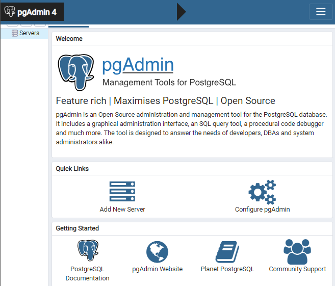


---
#### 4.5. Docker Composer - NPX HTTP Server (simple http server)

#### a. Installation procedure

* [Reading Pre-requisites before installation](https://share.atelie.software/subindo-um-servidor-web-em-1-minuto-31c0438ff6dd)

```sh
$ mkdir ~/docker-compose
$ mkdir ~/docker-compose/docker-npx-httpserver
$ cd    ~/docker-compose/docker-npx-httpserver

$ vim docker-compose.yml
version: '3'
services:
  web:
    image: node
    working_dir: /web
    command: npx http-server
    volumes:
      - .:/web
    ports:
      - 8080:8080

$ pwd # /home/ubuntu/docker-compose/docker-npx-httpserver
$ sudo docker-compose up
```

#### b. Configuration management

* docker-compose.yml:
  * NPX HTTP Server - port: 8080

#### c. Deploy Diagram

n/a

#### d. Demonstration

  * Suba **docker-compose** com arquivo de configuração default `docker-compose.yml`:
  * Faça wget http://localhost:8080

---
#### 4.6. Docker Composer - Oracle Database

#### a. Installation procedure

* [Reading Pre-requisites before installation - OracleDatabase on Docker - Single Instance](https://github.com/oracle/docker-images/blob/master/OracleDatabase/SingleInstance/README.md)
* [Reading Pre-requisites before installation - OracleDatabase - Single Instance](https://www.oracle.com/technetwork/pt/articles/database-performance/oracle-db12-2-no-docker-4427706-ptb.html)

```sh
$ mkdir ~/GitHome
$ cd    ~/GitHome
$ git clone https://github.com/oracle/docker-images.git
$ git clone https://github.com/MaksymBilenko/docker-oracle-12c.git
$ cd docker-oracle-12c
$ cd ~/GitHome/docker-images/OracleDatabase/SingleInstance/dockerfiles
$ ./buildDockerImage.sh 12.2.0.1 -s
$ docker run --name oracle-12-2 \
-p 1521:1521 -p 5500:5500 \
-e ORACLE_SID=ORCL \
-e ORACLE_PDB=ORCLPDB \
-e ORACLE_PWD=password \
-e ORACLE_CHARACTERSET=AMERICAN_AMERICA.AL32UTF8 \
-v oradata:/opt/oracle/oradata \
oracle/database:12.2.0-se

$ vim docker-compose.yml


$ pwd # /home/ubuntu/docker-compose/docker-oracle
$ sudo docker-compose up
```

#### b. Configuration management

* docker-compose.yml:
  * Oracle Database - port: 1521; user: ???; password:??? ; volume: db

#### c. Deploy Diagram


#### d. Demonstration

  * Subindo **docker-compose** com arquivo de configuração default `docker-compose.yml`:


---
#### 4.7. Docker - Jenkins

#### a. Installation procedure

* [Reading Pre-requisites](https://hub.docker.com/r/bitnami/jenkins/)

* Using Docker Command Line


```sh
$ echo *** Part I - Configuration files ....
$ mkdir ~/docker-cmdline
$ mkdir ~/docker-cmdline/docker-jenkins
$ cd ~/docker-cmdline/docker-jenkins

$ echo *** Part II - Network Tier ....
$ sudo docker network ls # create only once - first time you create, next times reuses
$ sudo docker network create jenkins-tier

$ echo *** Part III - Data Volume
$ sudo docker volume ls # create only once - first time you create, next times reuses
$ sudo docker volume create --name jenkins_data # Only once - first time you create, next times reuses

$ echo *** Part IV - Run Docker ...
$ sudo docker ps -a
$ sudo docker rm jenkins # You can ignore first time error message Error: No such container: jenkins
$ sudo docker run -d --name jenkins -p 8080:8080 -p 443:8443 --net jenkins-tier --volume jenkins_data:/bitnami bitnami/jenkins:latest
```


#### b. Configuration management

* acesse o Jenkins pela primeira vez pelo browser 
  * Jenkins URL: `http://localhost:8080/

* faça login com as credenciais abaixo:
  * JENKINS_USERNAME: `user`
  * JENKINS_PASSWORD: `bitnami`

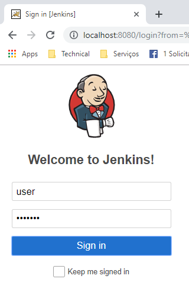

* instale os plugins sugeridos

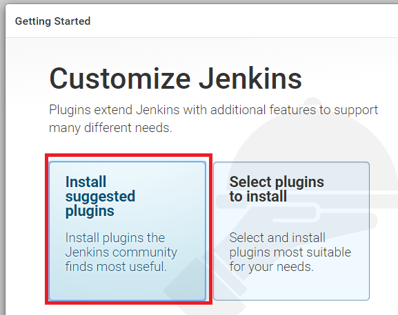

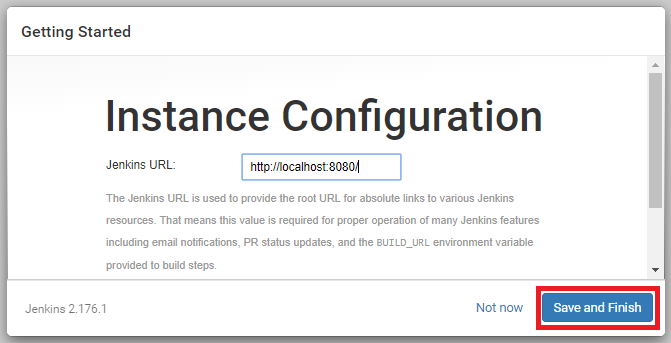

* Reinicie o Jenkins e faça novamente o login com usuário `user` e senha `bitnami`

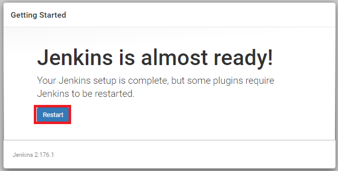

* Pronto! Benvindo ao Jenkins

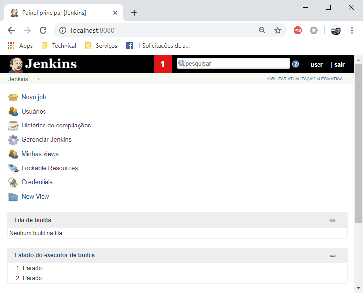


#### c. Deploy Diagram


#### d. Demonstration

  * Subindo **docker-compose** com arquivo de configuração `docker-compose-jenkins.yml`:

```sh
$ sudo docker-compose -f docker-compose-jenkins.yml up
```


  * Conectando com MySQL através do client em linha de comando `mysql`:

```sh
$ 
```

  * Conectando com MySQL através da aplicação web **phpMyAdmin**:


---
#### 4.8. Docker Composer - MongoDB

#### a. Installation procedure

* [Reading Pre-requisites](https://hub.docker.com/r/bitnami/mongodb/)

* Using Docker Compose

```sh
$ echo *** Part I - Configuration files ....
$ mkdir ~/docker-compose
$ mkdir ~/docker-compose/docker-mongodb/
$ cd ~/docker-compose/docker-mongodb

$ echo *** Part II - Configuring docker-compose.yml ...
$ vim docker-compose-mongodb.yml
version: '2'

services:
  mongodb:
    image: 'bitnami/mongodb:4.0'
    ports:
      - "27017:27017"
    volumes:
      - 'mongodb_data:/bitnami'

volumes:
  mongodb_data:
    driver: local
  :

$
$ sudo docker-compose -f docker-compose-mongodb.yml up -d
```


#### b. Configuration management

* n/a


#### c. Deploy Diagram


#### d. Demonstration

  * Subindo **docker-compose** com arquivo de configuração `docker-compose-mongodb.yml`:

```sh
$ sudo docker-compose -f docker-compose-mongodb.yml up -d
```

  * Conectando ao MongoDB:

```sh
$ mongo --eval 'db.runCommand({ connectionStatus: 1 })'
```


---
#### 4.9. Docker Composer - Redmine

#### a. Installation procedure

* [Reading Pre-requisites](https://hub.docker.com/_/redmine)

* Using Docker Compose:

```sh
$ echo *** Part I - Configuration files ....
$ mkdir ~/docker-compose
$ mkdir ~/docker-compose/docker-redmine/
$ cd ~/docker-compose/docker-redmine

$ echo *** Part II - Configuring docker-compose.yml ...
$ vim docker-compose-redmine.yml
version: '3.1'

services:

  redmine:
    image: redmine
    restart: always
    ports:
      - 8080:3000
    environment:
      REDMINE_DB_MYSQL: db
      REDMINE_DB_PASSWORD: example

  db:
    image: mysql:5.7
    restart: always
    environment:
      MYSQL_ROOT_PASSWORD: example
      MYSQL_DATABASE: redmine
  :

$
$ sudo docker-compose -f docker-compose-redmine.yml up   -d
$ sudo docker-compose -f docker-compose-redmine.yml down -d
```

* Using Docker Command Line:


#### b. Configuration management

* url: `http://localhost:8080/
* username: `admin`
* password: `admin123` (inicialmente configurada `admin`)


#### c. Deploy Diagram


#### d. Demonstration

  * Subindo **docker-compose** com arquivo de configuração `docker-compose-redmine.yml`:

```sh
$ sudo docker-compose -f docker-compose-redmine.yml up -d
```

  * Conectando ao Redmine `http://localhost:8080/` :
    * Login: `admin`
	* Password: `admin123`

---
#### 4.10. Docker Composer - Kafka

#### a. Installation procedure

* [Reading Pre-requisites](https://hub.docker.com/r/bitnami/kafka/)
* [Reading Tutorial](https://medium.com/trainingcenter/apache-kafka-codifica%C3%A7%C3%A3o-na-pratica-9c6a4142a08f)

* Using Docker Compose:

```sh
$ echo *** Part I - Configuration files ....
$ mkdir ~/docker-compose
$ mkdir ~/docker-compose/docker-kafka/
$ cd ~/docker-compose/docker-kafka

$ echo *** Part II - Configuring docker-compose.yml ...
$ vim docker-compose-kafka.yml
version: '2'

services:
  zookeeper:
    image: 'bitnami/zookeeper:latest'
    ports:
      - '2181:2181'
    volumes:
      - 'zookeeper_data:/bitnami/zookeeper'
  kafka:
    image: 'bitnami/kafka:0'
    ports:
      - '9092:9092'
    volumes:
      - 'kafka_data:/bitnami/kafka'
    environment:
      - KAFKA_ZOOKEEPER_CONNECT=zookeeper:2181

volumes:
  zookeeper_data:
    driver: local
  kafka_data:
    driver: local
  :

$
$ sudo docker-compose -f docker-compose-kafka.yml up -d
$ sudo docker-compose -f docker-compose-kafka.yml down
```

#### b. Configuration management

* zookeeper: Port=2181
* kafka: Port=9092, 


#### c. Deploy Diagram


#### d. Demonstration

  * Subindo **docker-compose** com arquivo de configuração `docker-compose-Kafka.yml`:

```sh
$ sudo docker-compose -f docker-compose-Kafka.yml up -d
```

  * Conectando ao Kafka `http://localhost:8080/` :
    * Login: `admin`
	* Password: `admin123`

---
#### 4.11. Docker Composer - Cassandra

#### a. Installation procedure

* [Reading Pre-requisites](https://hub.docker.com/r/bitnami/cassandra/)

* Using Docker Composer:

```sh
$ mkdir ~/docker-compose
$ mkdir ~/docker-compose/docker-cassandra
$ cd    ~/docker-compose/docker-cassandra

$ vim docker-compose-cassandra.yml
version: '2'

services:
  cassandra:
    image: 'bitnami/cassandra:3'
    ports:
      - '7000:7000'
      - '9042:9042'
    volumes:
      - 'cassandra_data:/bitnami'
    environment:
      - CASSANDRA_SEEDS=cassandra
      - CASSANDRA_PASSWORD_SEEDER=yes
      - CASSANDRA_PASSWORD=cassandra
volumes:
  cassandra_data:
    driver: local

  :

$
$ sudo docker-compose -f docker-compose-cassandra.yml up   -d
$ sudo docker-compose -f docker-compose-cassandra.yml down -d
```


#### b. Configuration management

* cassandra seeds...: `cassandra`
* cassandra password: `cassandra`
* ports.............: `7000` e `9042`


#### c. Deploy Diagram


#### d. Demonstration

  * Subindo **docker-compose** com arquivo de configuração `docker-compose-cassandra.yml`:

```sh
$ sudo docker-compose -f docker-compose-cassandra.yml up   -d
$ sudo docker-compose -f docker-compose-cassandra.yml down -d
```

  * Conectando ao Cassandra `http://localhost:8080/` :


---
#### 4.12. Docker - MQ-Series

#### a. Installation procedure

* [Reading Pre-requisites](https://hub.docker.com/r/ibmcom/mq/)
* [Reading Pre-requisites - Building a sample IBM MQ queue manager image using Docker](https://www.ibm.com/support/knowledgecenter/en/SSFKSJ_9.0.0/com.ibm.mq.con.doc/q114483_.htm)
* [Reading Pre-requisites - Building a sample base IBM MQ queue manager image](https://www.ibm.com/support/knowledgecenter/en/SSFKSJ_9.0.0/com.ibm.mq.con.doc/q114485_.htm)
* [IBM MQ JMS samples - Messaging developer patterns (Put/Get, Pub/Sub, Request/Response)](https://github.com/ibm-messaging/mq-docker#overview)

* Download Docker image

```sh
$ sudo docker pull ibmcom/mq
```

* Run Docker Image with defaults configuration

```sh
$ sudo docker run \
  --env LICENSE=accept \
  --env MQ_QMGR_NAME=QM1 \
  --publish 1414:1414 \
  --publish 9443:9443 \
  --detach \
  ibmcom/mq
```

* Create Docker Volumes

```sh
$ sudo docker volume create qm1data
```

* Run Docker Image with Volumes

```sh
$ sudo docker run \
  --env LICENSE=accept \
  --env MQ_QMGR_NAME=QM1 \
  --publish 1414:1414 \
  --publish 9443:9443 \
  --detach \
  --volume qm1data:/mnt/mqm \
  ibmcom/mq
```

* Executando comandos dentro da instância Docker 

```sh
$ CONTAINER_ID=`sudo docker ps | grep ibmcom/mq | cut -d ' ' -f 1`
$ echo CONTAINER_ID = $CONTAINER_ID
$ sudo docker exec \
  --tty \
  --interactive \
  ${CONTAINER_ID} \
  dspmq
```

#### b. Configuration management

* url: `https://127.0.0.1:9443/ibmmq/console`


* [MQ Developer Defaults](https://github.com/ibm-messaging/mq-docker#mq-developer-defaults)

```sh
Userid: admin Groups: mqm Password: passw0rd
Userid: app Groups: mqclient Password:
Queues: 
  DEV.QUEUE.1 
  DEV.QUEUE.2 
  DEV.QUEUE.3 
  DEV.DEAD.LETTER.QUEUE - Set as the Queue Manager's Dead Letter Queue.
Channels:
  DEV.ADMIN.SVRCONN - Set to only allow the admin user to connect into it and a Userid + Password must be supplied.
  DEV.APP.SVRCONN - Does not allow Administrator users to connect.
Listener:
  DEV.LISTENER.TCP - Listening on Port 1414.
Topic:
  DEV.BASE.TOPIC - With a topic string of dev/.
Authentication information
  DEV.AUTHINFO - Set to use OS as the user repository and adopt supplied users for authorization checks
Authority records
  Users in mqclient group have been given access connect to all Queues and topics starting with DEV.** and have put get pub and sub permissions.
```

* [Web Console - Configuration](https://github.com/ibm-messaging/mq-docker#web-console)

```sh
User: admin
Password: passw0rd
```


#### c. Deploy Diagram

* n/a

#### d. Demonstration

* url: `https://127.0.0.1:9443/ibmmq/console`

```sh
+-----------------------------------------+
| IBM MQ Console - Login                  |
|                                         |
|      Nome do usuário: [ admin    ]      |
|      Senha:           [ passw0rd ]      |
+-----------------------------------------+
```

* Console

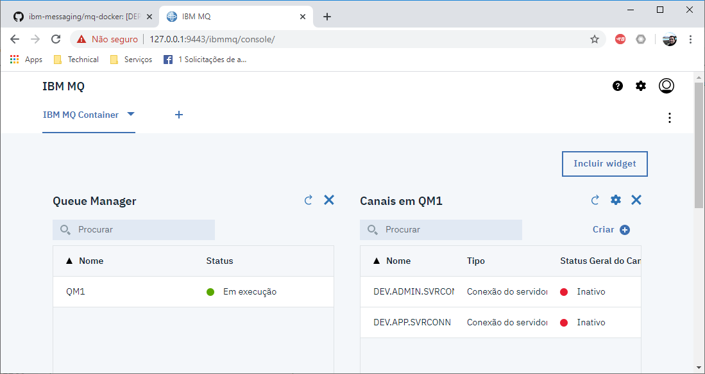


---
#### 4.13. Docker Composer - SugarCRM

#### a. Installation procedure

* [Reading Pre-requisites](https://hub.docker.com/r/spantree/sugarcrm)

* Using Docker Composer:

```sh
$ mkdir ~/docker-compose
$ mkdir ~/docker-compose/docker-sugarcrm
$ cd    ~/docker-compose/docker-sugarcrm

$ vim docker-compose-sugarcrm.yml
sugarcrm:
  build: .
  ports:
    - "8000:80"
  links:
    - "db"
  environment:
    DB_TYPE: mysql
    DB_MANAGER: MysqlManager
db:
  image: mysql
  environment:
    MYSQL_ROOT_PASSWORD: YZiT4p7BXUqpdgpc
    MYSQL_DATABASE: sugarcrm
    MYSQL_USER: sugarcrm
    MYSQL_PASSWORD: wTxbULZMrosNR86J
  :

$
$ sudo docker-compose -f docker-compose-sugarcrm.yml up
```


#### b. Configuration management

* url: http://127.0.0.1:8000/


#### c. Deploy Diagram

* n/a

#### d. Demonstration

  * Subindo **docker-compose** com arquivo de configuração `docker-compose-cassandra.yml`:

```sh
$ sudo docker-compose -f docker-compose-sugarcrm.yml up
```

  * Conectando ao Cassandra `http://localhost:8080/` :

---
#### 4.14. Docker - Bamboo Server

#### a. Installation procedure

* [Reading Pre-requisites](https://hub.docker.com/r/atlassian/bamboo-server)

* Using Docker Command Line:

```sh
$ sudo docker pull atlassian/bamboo-server

$ sudo docker volume create --name bambooVolume
$ sudo docker run -v bambooVolume:/var/atlassian/application-data/bamboo --name="bamboo" --init -d -p 54663:54663 -p 8085:8085 atlassian/bamboo-server
```

#### b. Configuration management

* url: http://127.0.0.1:8085/

* [Siga o passo-a-passo da instalação das licenças](doc/README_InstallBambooLicense_StepByStep.md)


#### c. Deploy Diagram

* n/a

#### d. Demonstration

  * Subindo o container `bamboo`:

```sh
$ sudo docker ps -a
CONTAINER ID        IMAGE                     COMMAND             CREATED             STATUS              PORTS                                              NAMES
5ec6d3ad8ea0        atlassian/bamboo-server   "/entrypoint.sh"    15 minutes ago      Up 3 minutes        0.0.0.0:8085->8085/tcp, 0.0.0.0:54663->54663/tcp   bamboo
```

```sh
$ sudo docker start bamboo
```

  * Conectando ao Bamboo Server `http://localhost:8085/`


---
#### 4.15. Docker - Ubuntu server

#### a. Installation procedure

* [Reading Pre-requisites](https://www.youtube.com/watch?v=0cDj7citEjE&t=682s)


* Using Docker Command Line:

```sh
sudo docker run -i -t ubuntu:18.04 /bin/bash
```


#### b. Configuration management

* n/a


#### c. Deploy Diagram

* n/a

#### d. Demonstration

* n/a

---
#### 4.16. Docker - Chef-server

#### a. Installation procedure

* [Reading Pre-requisites](https://hub.docker.com/r/cbuisson/chef-server/)


* Using Docker Command Line:

```sh
docker pull cbuisson/chef-server
```


#### b. Configuration management

* n/a


#### c. Deploy Diagram

* n/a

#### d. Demonstration

* n/a


---
#### 4.17. Docker - Nexus

#### a. Installation procedure

* [Reading Pre-requisites](https://hub.docker.com/r/sonatype/nexus3)


* Using Docker Command Line:

```sh
sudo docker pull sonatype/nexus3
sudo docker run -d -p 8081:8081 --name nexus sonatype/nexus3
```


#### b. Configuration management

* Persistent data

```sh
docker volume create --name nexus-data
docker run -d -p 8081:8081 --name nexus -v nexus-data:/nexus-data sonatype/nexus3
```


#### c. Deploy Diagram

* n/a

#### d. Demonstration

* n/a

---
#### 4.18. Docker - SonarQube

#### a. Installation procedure

* [Reading Pre-requisites](https://hub.docker.com/_/sonarqube/)


* Using Docker Command Line:

```sh
sudo docker pull sonarqube
sudo docker run -d --name sonarqube -p 9000:9000 sonarqube
```


#### b. Configuration management

* n/a


#### c. Deploy Diagram

* n/a

#### d. Demonstration

* n/a


---
#### 4.19. Docker - WebSphere - 8.5

#### a. Installation procedure

* [Reading Pre-requisites](https://hub.docker.com/r/ibmcom/websphere-traditional)


* Using Docker Command Line:

```sh
docker pull ibmcom/websphere-traditional:8.5.5.14-profile
```


#### b. Configuration management

* n/a


#### c. Deploy Diagram

* n/a

#### d. Demonstration

* n/a


---
#### 4.20. Docker - Hercules

#### a. Installation procedure

* [Reading Pre-requisites](https://hub.docker.com/r/hermajordoctor/hercules)


* Using Docker Command Line:

```sh
docker pull hermajordoctor/hercules
docker run -p 3270:3270 -p 8081:8081 hermajordoctor/hercules
```


#### b. Configuration management

* n/a


#### c. Deploy Diagram

* n/a

#### d. Demonstration

* n/a


---
#### 4.21. Docker - Jira Core

#### a. Installation procedure

* [Reading Pre-requisites](https://hub.docker.com/r/atlassian/jira-core/)

* Using Docker Command Line:

```sh
$ sudo docker volume create --name jiraVolume
$ sudo docker run -v jiraVolume:/var/atlassian/application-data/jira --name="jira" -d -p 8080:8080 atlassian/jira-software
```


#### b. Configuration management

* url: http://127.0.0.1:8080/

* [Siga o passo-a-passo da instalação das licenças](doc/README_InstallJiraCoreLicense_StepByStep.md)


#### c. Deploy Diagram

* n/a


#### d. Demonstration

  * Subindo o container `jira`:

```sh
$ sudo docker ps -a
CONTAINER ID        IMAGE                     COMMAND             CREATED             STATUS              PORTS                                              NAMES
936e1e0b5cf7        atlassian/jira-software   "/tini -- /entrypoin…"   2 minutes ago       Up About a minute   0.0.0.0:8080->8080/tcp                             jira
```

```sh
$ sudo docker start jira
```

  * Conectando ao Bamboo Server `http://localhost:8080/` :

---
#### 4.22. Docker - Confluence

#### a. Installation procedure

* [Reading Pre-requisites](https://hub.docker.com/r/atlassian/confluence-server/)

* Using Docker Command Line:

```sh
$ sudo docker pull atlassian/confluence-server

$ docker run -v confluenceVolume:/var/atlassian/application-data/confluence --name="confluence" -d -p 8090:8090 -p 8091:8091 atlassian/confluence-server
$ ! docker run -v /data/your-confluence-home:/var/atlassian/application-data/confluence --name="confluence" -d -p 8090:8090 -p 8091:8091 atlassian/confluence-server
```


#### b. Configuration management

* url: http://127.0.0.1:8091/

* [Siga o passo-a-passo da instalação das licenças](doc/README_InstallConfluenceLicense_StepByStep.md)


#### c. Deploy Diagram

* n/a

#### d. Demonstration

  * Subindo o container `jira`:

```sh
$ sudo docker ps -a
CONTAINER ID        IMAGE                     COMMAND             CREATED             STATUS              PORTS                                              NAMES
936e1e0b5cf7        atlassian/jira-software   "/tini -- /entrypoin…"   2 minutes ago       Up About a minute   0.0.0.0:8080->8080/tcp                             jira
```

```sh
$ sudo docker start jira
```

  * Conectando ao Bamboo Server `http://localhost:8080/` :

---
#### 4.23. Docker Composer - WordPress, MySQL 5.7

#### a. Installation procedure

* [Reading Pre-requisites before installation](https://docs.docker.com/compose/wordpress/)

```sh
$ mkdir ~/docker-compose/docker-wordpress-mysql
$ cd    ~/docker-compose/docker-wordpress-mysql
$ vim docker-compose.yml
version: '3.3'

services:
   db:
     image: mysql:5.7
     ports:
       - "3306:3306"
     volumes:
       - db_data:/var/lib/mysql
     restart: always
     environment:
       MYSQL_ROOT_PASSWORD: password
       MYSQL_DATABASE: wordpress
       MYSQL_USER: wordpress
       MYSQL_PASSWORD: wordpress

   wordpress:
     depends_on:
       - db
     image: wordpress:latest
     ports:
       - "80:80"
     restart: always
     environment:
       WORDPRESS_DB_HOST: db:3306
       WORDPRESS_DB_USER: wordpress
       WORDPRESS_DB_PASSWORD: wordpress
       WORDPRESS_DB_NAME: wordpress
volumes:
    db_data: {}

$ sudo docker-compose up
$ sudo docker-compose down  # parar o serviço
```


#### b. Configuration management

* docker-compose.yml:
  * WordPress - port: 80; Username: wordpress
  * MySQL - port: 3306; user: wordpress; password: wordpress; volume: db_data

#### c. Deploy Diagram

n/a

#### d. Demonstration

  * Suba **docker-compose** com arquivo de configuração default `docker-compose.yml`:
  * Abra a URL `http://localhost:80` e siga o passo-a-passo da instalação:

* Passo 1: Defina a linguagem:


* Passo 2: Defina título do site, usuário e senha
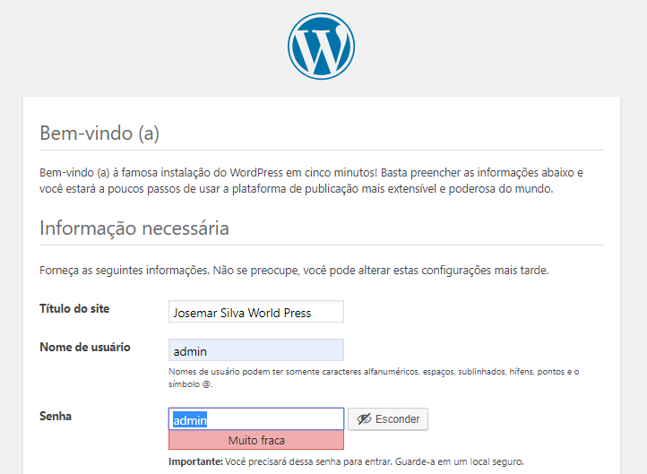

* Passo 3: Clique no botão que acesso o site:

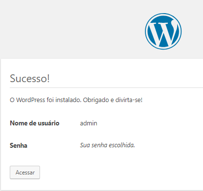

* Passo 4: Informe `login` e `senha` e acesse o site

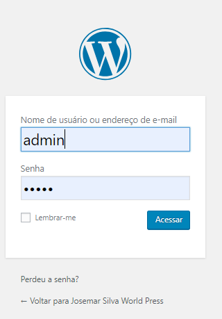

* Passo 5: Acesse a página principal do site 

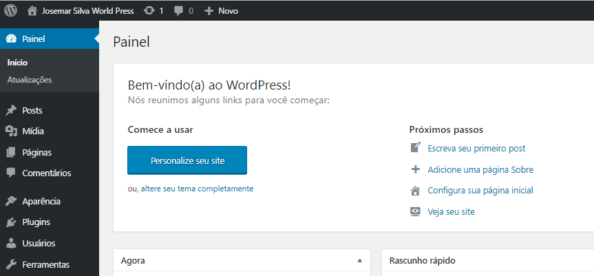


---
#### 4.24. Docker - DB2

#### a. Installation procedure

* [Reading Pre-requisites before installation](https://hub.docker.com/r/ibmcom/db2)

```sh
$ mkdir /opt/githome
$ cd    /opt/githome
$ sudo docker pull ibmcom/db2
```


#### b. Configuration management

n/a

#### c. Deploy Diagram

n/a

#### d. Demonstration

n/a

---

